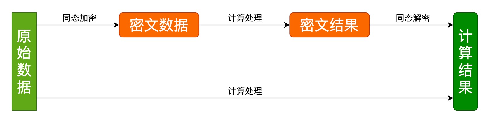

## 背景
随着大数据与人工智能的快速发展，个人隐私数据泄露和滥用时有发生，隐私安全问题也越来越被重视，国家于 2020 年施行密码法、2021 年施行个人信息保护法，对个人隐私数据和数据安全加密有更高的要求。因此，隐私计算也不断地被提及和关注，源于其有优秀的数据保护作用，使得『数据不出域、可用不可见』，限定了数据的使用场景，防止了数据的泄露，而引起了业界的热捧。
隐私计算是指在保护数据本身不对外泄露的前提下，实现数据共享和计算的技术集合，共享数据价值，而非源数据本身，实现数据可用不可见。
隐私计算对于个人用户来说，有助于保障个人信息安全；
对于企业来说，隐私计算是数据协作过程中履行数据保护义务的关键路径；
对于政府来说，隐私计算实现数据价值最大化的重要支撑。

隐私计算目前在金融、医疗、电信、政务等领域均在开展应用试验，比如：

   - 银行和金融机构在不泄露各方原始数据的前提下，进行分布式模型训练，可以有效降低信贷、欺诈等风险；
   - 医疗机构无需共享原始数据便可进行联合建模和数据分析，数据使用方在不侵犯用户隐私的情况下，可以使用建模运算结果数据，有效推动医疗行业数据高效利用；
   - ……

隐私计算的相关技术有多方安全计算（MPC）、可信执行环境（TEE）、联邦学习（FL）、同态加密（HE）、差分隐私（DP）、零知识证明（ZKP）、区块链（BC）等等。这些技术各有优缺点，隐私计算的产品或者平台也是由这些技术来搭建。

其中与密码学明显相关的是同态加密，目前同态加密算法的开源项目各有千秋，用户使用比较复杂。Tongsuo 作为基础密码库，应该提供一套简单易用和高效的同态加密算法实现和接口，让上层应用更方便简单地使用同态加密算法。

此外，随着隐私计算技术的兴起，蚂蚁集团推出了开箱即用、软硬件结合的隐私计算基础设施，一站式解决方案，即可信原生一体机。Tongsuo 作为蚂蚁可信原生一体机中的核心基础软件密码库，将同态加密等隐私计算所需的相关密码学能力整合其中，为可信原生一体机的用户带来更加便捷高效的使用体验。
## 同态加密
同态加密（Homomorphic Encryption, HE）是指满足密文同态运算性质的加密算法，按性质分为加法同态和乘法同态：

- 加法同态
   1. 满足： $E(x) \oplus E(y)=E(x+y)$
   2. 椭圆曲线加密算法满足加法同态：

$E(x)=g^x \longrightarrow E(x) \oplus E(y)=g^x g^y = g^{x+y} = E(x+y)$

- 乘法同态
   1. 满足：$E(x) \otimes E(y)=E(xy)$
   2. RSA加密算法满足乘法同态：

$E(x)=x^e \longrightarrow E(x) \otimes E(y)=x^e y^e = (xy)^e = E(xy)$
同态加密后得到密文数据，对密文数据进行同态加法或者乘法得到密文结果，将密文结果同态解密后可以得到原始数据直接加法或者乘法的计算结果，如下图：

根据满足加法和乘法的运算次数又分为：全同态加密和半同态加密

- 全同态加密（ Fully Homomorphic Encryption, FHE ）
   - 支持任意次的加法和乘法运算
   - 难实现、性能差（密钥过大，运行效率低，密文过大）
   - 主流算法：Gentry、BFV、BGV、CKKS
   - 需要实现的接口：（非本文重点，略）
- 半同态加密（Partially Homomorphic Encryption, PHE）
   - 只支持加法或乘法中的一种运算，或者可同时支持有限次数的加法和乘法运算
   - 原理简单、易实现、性能好
   - 主流算法：RSA、ElGamal、Paillier
   - 需要实现的接口：
      - KeyGen()：密钥生成算法，用于产生加密数据的公钥 PK（Public Key）和私钥 SK（Secret Key），以及一些公共参数 PP（Public Parameter）。
      - Encrypt()：加密算法，使用 PK 对用户数据 Data 进行加密，得到密文 CT（Ciphertext）。
      - Decrypt()：解密算法，使用 SK 对密文 CT 解密得到数据原文 PT（Plaintext）。
      - Add()：密文同态加法，输入两个 CT 进行同态加运算。
      - Sub()：密文同态减法，输入两个 CT 进行同态减法算。
      - ScalaMul() 或者 Mul()：密文同态标量乘法，输入一个 CT 和一个标量 PT，计算 CT 的标量乘结果。
### EC-ElGamal 原理
ElGamal 加密算法是基于 Diffie-Hellman 密钥交换的非对称加密算法，EC-ElGamal 是 ECC 的一种，是把ElGamal 移植到椭圆曲线上来的实现，主要计算有：椭圆曲线点加、点减、点乘、模逆和离散对数。

以下是 EC-ElGamal 的算法原理：

- 公共参数：
   - G：椭圆曲线基点
   - SK：私钥，SK=d，d 是 0 到椭圆曲线的阶 q 之间的随机数
   - PK：公钥，PK=dG
- 加密
   - 明文 m，随机数 r
   - 计算密文 C：$C=Encrypt(m,r)=(rG,rPK+mG)$
   - 明文 m 的取值范围为模 order(G) 的模空间，但实际使用时 m 需限制为较小的数（例如 32 比特长度），否则椭圆曲线离散对数问题（ECDLP）无法求解。
- 解密
   - 计算 rPK：$𝑟𝑃𝐾=𝑟∗𝑑∗𝐺=𝑑∗𝑟𝐺=𝑑∗𝐶[0]=𝑆𝐾∗𝐶[0]$
   - 计算 mG：$𝑚𝐺=𝑟𝑃𝐾+𝑚𝐺−𝑟𝑃𝐾=𝐶[1]−𝑟𝑃𝐾$
   - 计算 mG 的 ECDLP，获得明文 m。
- 密文加法、密文减法
   - 两个密文 $C_1 , C_2 \longrightarrow 𝐶_1=(𝑟_1 𝐺,  𝑟_1 𝑃𝐾+𝑚_1 𝐺),   𝐶_2=(𝑟_2 𝐺, 𝑟_2 𝑃𝐾+𝑚_2 𝐺)$
   - 密文加：对 2 个密文的 2 个 ECC 点分别做点加，共 2 个点加，公式如下：
      - $𝐴𝑑𝑑(𝐶_1, 𝐶_2 )=(𝑟_1 𝐺+𝑟_2 𝐺, 𝑟_1 𝑃𝐾+𝑚_1 𝐺+𝑟_2 𝑃𝐾+𝑚_2 𝐺)=((𝑟_1+𝑟_2 )𝐺,(𝑟_1+𝑟_2 )𝑃𝐾+(𝑚_1+𝑚_2 )𝐺)=𝐸𝑛𝑐𝑟𝑦𝑝𝑡((𝑚_1+𝑚_2 ),(𝑟_1+𝑟_2 ))$
      - 如上公式与明文 $m_1+m_2$ 的同态加密结果一致：$Encrypt((m_1+m_2), r)$，这里 $r=r_1+r_2$
   - 密文减：对 2 个密文的 2 个 ECC 点分别做点减，共 2 个点减，公式如下：
      - $𝑆𝑢𝑏(𝐶_1,𝐶_2 )=(𝑟_1 𝐺−𝑟_2 𝐺,𝑟_1 𝑃𝐾+𝑚_1 𝐺−𝑟_2 𝑃𝐾−𝑚_2 𝐺)$ $=((𝑟_1−𝑟_2 )𝐺,(𝑟_1−𝑟_2 )𝑃𝐾+(𝑚_1−𝑚_2 )𝐺)=𝐸𝑛𝑐𝑟𝑦𝑝𝑡((𝑚_1−𝑚_2 ),(𝑟_1−𝑟_2 ))$
      - 如上公式与明文 $m_1-m_2$ 的同态加密结果一致：$Encrypt((m_1-m_2), r)$，这里 $r=r_1-r_2$
- 密文标量乘法
   - 密文：$𝐶_1=(𝑟_1 𝐺, 𝑟_1 𝑃𝐾+𝑚_1 𝐺)$，明文：$𝑚_2$
   - 对密文的 2 个 ECC 点分别用 𝑚_2 做点乘，共 2 个点乘，公式如下：
      - $𝑀𝑢𝑙(𝐶_1, 𝑚_1 )=(𝑚_2 𝑟_1 𝐺, 𝑚_2 (𝑟_1 𝑃𝐾+𝑚_1 𝐺))$ $=(𝑚_2 𝑟_1 𝐺, 𝑚_2 𝑟_1 𝑃𝐾+𝑚_2 𝑚_1 𝐺)=𝐸𝑛𝑐𝑟𝑦𝑝𝑡(𝑚_2 𝑚_1, 𝑚_2 𝑟_1)$
   - 如上公式与明文 $m_2m_1$的同态加密结果一致：$Encrypt(m_2m_1, r)$，这里 $r=m_2r_1$
## 算法实现
### 接口定义

- 对象相关接口
   - 上下文对象：`EC_ELGAMAL_CTX`，该对象用来保存公私钥以及一些其他内部用到的信息，是 EC-ElGamal 算法其他接口的第一个参数。接口如下：
        ```c
        //创建 EC_ELGAMAL_CTX 对象，key 为 ECC 公钥或者私钥的 EC_KEY 对象
        EC_ELGAMAL_CTX *EC_ELGAMAL_CTX_new(EC_KEY *key);

        //释放 EC_ELGAMAL_CTX 对象
        void EC_ELGAMAL_CTX_free(EC_ELGAMAL_CTX *ctx);
        ```

   - 解密表对象：`EC_ELGAMAL_DECRYPT_TABLE`，该对象用来保存解密表的内部信息。椭圆曲线离散对数问题（ECDLP）只有爆力破解的方法可求解，而爆力破解的速度比较慢，通常的做法是使用小步大步算法（Baby-Step，Giant-Step，BSGS）。总体思想是提前将所有可能的明文结果提前运算后，保存到 hash 表中，下次只需要进行少量的运算和 hash 表查找就可以得到结果，大大提高 ECDLP 的解密效率，但解密表的初始化可能比较慢，而且解密表的实现事关解密速度，后面考虑可以开放接口的实现给上层应用，所以这里先定义了一个解密表的对象和默认实现。接口如下：
        ```c
        //创建 EC_ELGAMAL_DECRYPT_TABLE 对象
        //decrypt_negative 为 1 时表示该解密表可以解密负数，初始化解密表时将可能的负数运算后插入到 hash 中。
        EC_ELGAMAL_DECRYPT_TABLE *EC_ELGAMAL_DECRYPT_TABLE_new(EC_ELGAMAL_CTX *ctx,
                                                            int32_t decrypt_negative);

        //释放 EC_ELGAMAL_DECRYPT_TABLE 对象
        void EC_ELGAMAL_DECRYPT_TABLE_free(EC_ELGAMAL_DECRYPT_TABLE *table);

        //设置 EC_ELGAMAL_DECRYPT_TABLE 对象到上下文对象中
        //解密时如果存在解密表则使用解密表进行求解，否则直接爆力破解，速度会很慢
        void EC_ELGAMAL_CTX_set_decrypt_table(EC_ELGAMAL_CTX *ctx,
                                            EC_ELGAMAL_DECRYPT_TABLE *table);
        ```

   - 密文对象：`EC_ELGAMAL_CIPHERTEXT`，由上面原理可知，加密之后得到的结果是两个点，该对象是用来保存加密后的密文信息（两个点）。接口如下：
        ```c
        //创建 EC_ELGAMAL_CIPHERTEXT 对象
        EC_ELGAMAL_CIPHERTEXT *EC_ELGAMAL_CIPHERTEXT_new(EC_ELGAMAL_CTX *ctx);

        //释放 EC_ELGAMAL_CIPHERTEXT 对象
        void EC_ELGAMAL_CIPHERTEXT_free(EC_ELGAMAL_CIPHERTEXT *ciphertext);
        ```

- 加密/解密接口
    ```c
    //加密，将明文 plaintext 进行加密，结果保存到 EC_ELGAMAL_CIPHERTEXT 对象指针 r 中
    int EC_ELGAMAL_encrypt(EC_ELGAMAL_CTX *ctx, EC_ELGAMAL_CIPHERTEXT *r, int32_t plaintext);

    //解密，将密文 ciphertext 进行解密，结果保存到 int32_t 指针 r 中
    int EC_ELGAMAL_decrypt(EC_ELGAMAL_CTX *ctx, int32_t *r, EC_ELGAMAL_CIPHERTEXT *ciphertext);
    ```

- 密文加/减/标量乘运算接口
    ```c
    //密文加，r = c1 + c2
    int EC_ELGAMAL_add(EC_ELGAMAL_CTX *ctx, EC_ELGAMAL_CIPHERTEXT *r,
                    EC_ELGAMAL_CIPHERTEXT *c1, EC_ELGAMAL_CIPHERTEXT *c2);

    //密文减，r = c1 - c2
    int EC_ELGAMAL_sub(EC_ELGAMAL_CTX *ctx, EC_ELGAMAL_CIPHERTEXT *r,
                    EC_ELGAMAL_CIPHERTEXT *c1, EC_ELGAMAL_CIPHERTEXT *c2);

    //标量密文乘，r = m * c
    int EC_ELGAMAL_mul(EC_ELGAMAL_CTX *ctx, EC_ELGAMAL_CIPHERTEXT *r,
                    EC_ELGAMAL_CIPHERTEXT *c, int32_t m);
    ```

- 编码/解码接口

同态加密涉及到多方参与，可能会需要网络传输，这就将密文对象 EC_ELGAMAL_CIPHERTEXT 编码后才能传递给对方，对方也需要解码得到 EC_ELGAMAL_CIPHERTEXT 对象后才能调用其他接口进行运算。

接口如下：
```c
//编码，将密文 ciphertext 编码后保存到 out 指针中，out 指针的内存需要提前分配好；
//如果 out 为 NULL，则返回编码所需的内存大小；
//compressed 为是否采用压缩方式编码，1 为压缩编码（编码结果长度较小），0 为正常编码（编码结果长度较大）
size_t EC_ELGAMAL_CIPHERTEXT_encode(EC_ELGAMAL_CTX *ctx, unsigned char *out,
                                    size_t size, EC_ELGAMAL_CIPHERTEXT *ciphertext,
                                    int compressed);

//解码，将长度为 size 的内存数据 in 解码后保存到密文对象 r 中
int EC_ELGAMAL_CIPHERTEXT_decode(EC_ELGAMAL_CTX *ctx, EC_ELGAMAL_CIPHERTEXT *r,
                                 unsigned char *in, size_t size);
```
### 核心实现
Tongsuo 是 OpenSSL 的衍生版，内部支持了很多椭圆曲线算法的实现。比如，已支持国际（prime256v1、secp384r1 等）和国密（SM2）的大部分椭圆曲线，天生实现了椭圆曲线点运算、公私钥生成等基础算法，所以在 Tongsuo 实现 EC-ElGamal 算法的核心实现主要是 EC-ElGamal 原理的实现和 ECDLP 求解算法的实现，总共几百行代码，查看代码请移步 github：[https://github.com/Tongsuo-Project/Tongsuo/blob/master/crypto/ec/ec_elgamal.c](https://github.com/Tongsuo-Project/Tongsuo/blob/master/crypto/ec/ec_elgamal.c)
## 用法&例子
### demo 程序
```c
#include <stdio.h>
#include <time.h>
#include <openssl/ec.h>
#include <openssl/pem.h>

#define CLOCKS_PER_MSEC (CLOCKS_PER_SEC/1000)

int main(int argc, char *argv[])
{
    int ret = -1;
    uint32_t r;
    clock_t begin, end;
    EC_KEY *sk_eckey = NULL, *pk_eckey = NULL;
    EC_ELGAMAL_CTX *ctx1 = NULL, *ctx2 = NULL;
    EC_ELGAMAL_CIPHERTEXT *c1 = NULL, *c2 = NULL, *c3 = NULL;
    EC_ELGAMAL_DECRYPT_TABLE *table = NULL;
    FILE *pk_file = fopen("ec-pk.pem", "rb");
    FILE *sk_file = fopen("ec-sk.pem", "rb");

    if ((pk_eckey = PEM_read_EC_PUBKEY(pk_file, NULL, NULL, NULL)) == NULL)
        goto err;
    if ((sk_eckey = PEM_read_ECPrivateKey(sk_file, NULL, NULL, NULL)) == NULL)
        goto err;

    if ((ctx1 = EC_ELGAMAL_CTX_new(pk_eckey)) == NULL)
        goto err;
    if ((ctx2 = EC_ELGAMAL_CTX_new(sk_eckey)) == NULL)
        goto err;

    begin = clock();
    if ((table = EC_ELGAMAL_DECRYPT_TABLE_new(ctx2, 0)) == NULL)
        goto err;

    EC_ELGAMAL_CTX_set_decrypt_table(ctx2, table);
    end = clock();
    printf("EC_ELGAMAL_DECRYPT_TABLE_new(1) cost: %lfms\n", (double)(end - begin)/CLOCKS_PER_MSEC);
    
    if ((c1 = EC_ELGAMAL_CIPHERTEXT_new(ctx1)) == NULL)
        goto err;
    if ((c2 = EC_ELGAMAL_CIPHERTEXT_new(ctx1)) == NULL)
        goto err;

    begin = clock();
    if (!EC_ELGAMAL_encrypt(ctx1, c1, 20000021))
        goto err;
    end = clock();
    printf("EC_ELGAMAL_encrypt(20000021) cost: %lfms\n", (double)(end - begin)/CLOCKS_PER_MSEC);

    begin = clock();
    if (!EC_ELGAMAL_encrypt(ctx1, c2, 500))
        goto err;
    end = clock();
    printf("EC_ELGAMAL_encrypt(500) cost: %lfms\n", (double)(end - begin)/CLOCKS_PER_MSEC);

    if ((c3 = EC_ELGAMAL_CIPHERTEXT_new(ctx1)) == NULL)
        goto err;

    begin = clock();
    if (!EC_ELGAMAL_add(ctx1, c3, c1, c2))
        goto err;
    end = clock();
    printf("EC_ELGAMAL_add(C2000021,C500) cost: %lfms\n", (double)(end - begin)/CLOCKS_PER_MSEC);

    begin = clock();
    if (!(EC_ELGAMAL_decrypt(ctx2, &r, c3)))
        goto err;
    end = clock();
    printf("EC_ELGAMAL_decrypt(C20000021,C500) result: %d, cost: %lfms\n", r, (double)(end - begin)/CLOCKS_PER_MSEC);

    begin = clock();
    if (!EC_ELGAMAL_mul(ctx1, c3, c2, 800))
        goto err;
    end = clock();
    printf("EC_ELGAMAL_mul(C500,800) cost: %lfms\n", (double)(end - begin)/CLOCKS_PER_MSEC);

    begin = clock();
    if (!(EC_ELGAMAL_decrypt(ctx2, &r, c3)))
        goto err;
    end = clock();
    printf("EC_ELGAMAL_decrypt(C500,800) result: %d, cost: %lfms\n", r, (double)(end - begin)/CLOCKS_PER_MSEC);

    
    printf("EC_ELGAMAL_CIPHERTEXT_encode size: %zu\n", EC_ELGAMAL_CIPHERTEXT_encode(ctx2, NULL, 0, NULL, 1));
    
    ret = 0;
err:
    EC_KEY_free(sk_eckey);
    EC_KEY_free(pk_eckey);
    EC_ELGAMAL_DECRYPT_TABLE_free(table);
    EC_ELGAMAL_CIPHERTEXT_free(c1);
    EC_ELGAMAL_CIPHERTEXT_free(c2);
    EC_ELGAMAL_CIPHERTEXT_free(c3);
    EC_ELGAMAL_CTX_free(ctx1);
    EC_ELGAMAL_CTX_free(ctx2);
    fclose(sk_file);
    fclose(pk_file);
    return ret;
}
```
### 编译和运行

- 先确保 Tongsuo 开启 ec_elgamal，如果是手工编译 Tongsuo，可参考如下编译步骤：
    ```bash
    # 下载代码
    git clone git@github.com:Tongsuo-Project/Tongsuo.git


    # 编译参数需要加上：enable-ec_elgamal，我这里是在 macOS 系统上编译，所以是 darwin64-x86_64-cc，其他系统需要切换一下
    ./Configure darwin64-x86_64-cc --debug no-shared no-threads enable-ec_elgamal --strict-warnings -fPIC --prefix=/usr/local/tongsuo-debug

    # 编译
    make -j4

    # 安装到目录 /usr/local/tongsuo-debug 
    sudo make install
    ```

- 编译 demo 程序
    ```bash
    gcc -Wall -g -o ec_elgamal_test ./ec_elgamal_test.c -I/usr/local/tongsuo-debug/include -L/usr/local/tongsuo-debug/lib -lssl -lcrypto
    ```

- 生成 ECC 公私钥
    ```bash
    # 先生成私钥，这里生成的是 SM2 曲线的私钥
    /usr/local/tongsuo-debug/bin/openssl ecparam -genkey -name SM2 -out ec-sk.pem
    # 用私钥生成公钥
    /usr/local/tongsuo-debug/bin/openssl ec -in ./ec-sk.pem -pubout -out ec-pk.pem
    ```

- 运行结果
    ```bash
    $ ./ec_elgamal_test
    EC_ELGAMAL_DECRYPT_TABLE_new(0) cost: 2557.715000ms
    EC_ELGAMAL_encrypt(20000021) cost: 1.448000ms
    EC_ELGAMAL_encrypt(500) cost: 1.605000ms
    EC_ELGAMAL_add(C2000021,C500) cost: 0.014000ms
    EC_ELGAMAL_decrypt(C20000021,C500) result: 20000521, cost: 12.748000ms
    EC_ELGAMAL_mul(C500,800) cost: 1.562000ms
    EC_ELGAMAL_decrypt(C500,800) result: 400000, cost: 1.137000ms
    EC_ELGAMAL_CIPHERTEXT_encode size: 66
    ```

- 注意事项

EC_ELGAMAL_DECRYPT_TABLE_new 函数第二个参数指定是否支持负数解密，如果支持负数解密会影响解密性能，因为查询解密表的次数变多了，以及点的运算变多了，同时构造支持负数的解密表需要的时间也比较长，如下是支持负数解密的运行结果：
```bash
$ ./ec_elgamal_test
EC_ELGAMAL_DECRYPT_TABLE_new(1) cost: 99023.542000ms
EC_ELGAMAL_encrypt(20000021) cost: 1.451000ms
EC_ELGAMAL_encrypt(500) cost: 1.426000ms
EC_ELGAMAL_add(C2000021,C500) cost: 0.021000ms
EC_ELGAMAL_decrypt(C20000021,C500) result: 20000521, cost: 461.471000ms
EC_ELGAMAL_sub(C500,C2000021) cost: 0.025000ms
EC_ELGAMAL_decrypt(C500,C20000021) result: -19999521, cost: 830.430000ms
EC_ELGAMAL_mul(C500,800) cost: 1.568000ms
EC_ELGAMAL_decrypt(C500,800) result: 400000, cost: 261.117000ms
EC_ELGAMAL_CIPHERTEXT_encode size: 66
```


