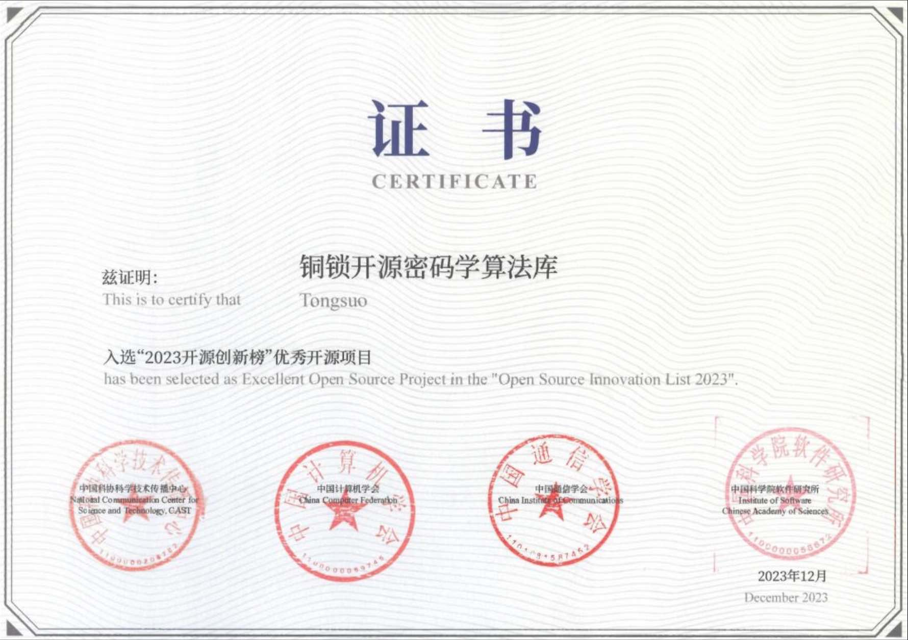
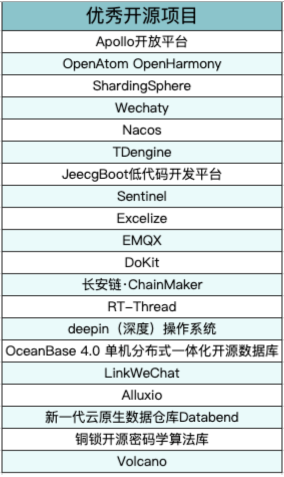

	
2023年12月15日，由**中国科协科学技术传播中心**、**中国计算机学会**、**中国通信学会**、**中国科学院软件研究所**共同主办，CSDN 承办的 2023 开源创新榜专家评审会在国家科技传播中心成功举办。评委会主任、中国计算机学会开源发展委员会主任王怀民院士，评委会副主任、中国科协科学技术传播中心副主任陈锐，评委会副主任、中国通信学会副理事长兼秘书长张延川，评委会副主任、中国科学院软件研究所所长赵琛与来自全国学会、大学、科研院所、企业、开源基金会、行业联盟等二十多位开源专家共同参与了本届榜单评审工作，会议由陈锐主持。

2023 年开源创新榜相较往年有以下几个变化：

**一是进一步提升权威性**，主办单位新加入中国计算机学会、中国通信学会、中国科学院软件研究所，四家主办单位优势互补，共同推动榜单策划、征集申报、专家评审等工作重点。

**二是进一步提升公信力**，由王怀民院士担任评委会主任，指导组建了结构更加科学、领域更加全面的评审专家库，从中提名形成最终评审专家。

**三是进一步提升专业度**，围绕项目、社区、人物三大类别，四家主办单位打磨了更加客观、严谨、贴合实际的评审标准和更加开放、公平、科学的评审办法，在征集过程中公开标准细节，接受社会的意见反馈，形成良性循环。

评审委员会主任王怀民院士指出，人类文明和科技文明发展中，一项成果得以记录、传播、共享才对推动社会进步有价值，开源是群体智慧的现代表征，在当下推动高质量发展、高水平安全具有重要现实意义。通过开源创新榜征集评选工作，可以挖掘和推广我国在开源技术领域的优秀成果和先进经验，为一线科技工作者及其创新成果创造更多展示、交流、推广的机会，希望大家共同努力，将开源创新榜打造成为业界最最权威、最典型和最具影响力的标杆。

评委会最终评选出优秀开源项目 20 个，开放原子开源基金会旗下“孵化期”开源项目“铜锁开源密码学算法库”入选其中：

铜锁（Tongsuo）是一个提供现代密码学算法和安全通信协议的开源基础密码库，为存储、网络、密钥管理、隐私计算等诸多业务场景提供底层的密码学基础能力，实现数据在传输、使用、存储等过程中的私密性、完整性和可认证性，为数据生命周期中的隐私和安全提供保护能力。

铜锁于2020年10月开源，已获得国家密码管理局商用密码检测中心颁发的商用密码产品认证证书，符合GM/T 0028《密码模块安全技术要求》的安全一级要求，助力用户在密改、密评、等保检查等过程中，更加严谨地满足商用密码技术合规的要求。
当前，铜锁开源项目已经由蚂蚁集团完成了向开放原子开源基金会的捐赠，成为基金会的“孵化期”项目，也是基金会唯一的密码学方向开源项目。在基金会孵化过程中，铜锁开源社区先后启动了“铜锁嵌入式版”和“RustyVault密钥管理系统”两个新项目的开发，已从单一开源项目发展为项目群。蚂蚁集团在铜锁完成捐赠后持续对项目进行投入，成立了铜锁项目管理委员会，引入多家领军企业参与铜锁开源项目的管理，推动铜锁进入到了独立发展的新阶段。
