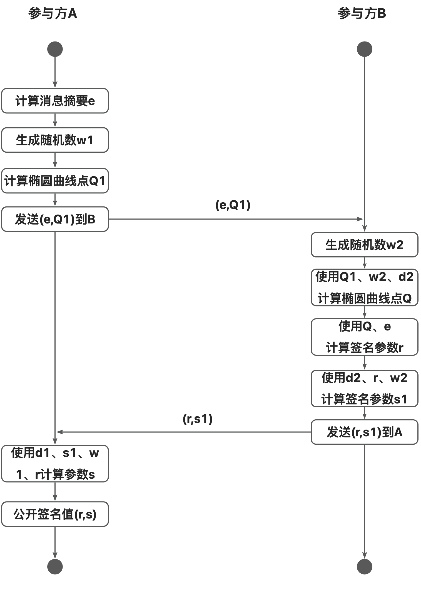
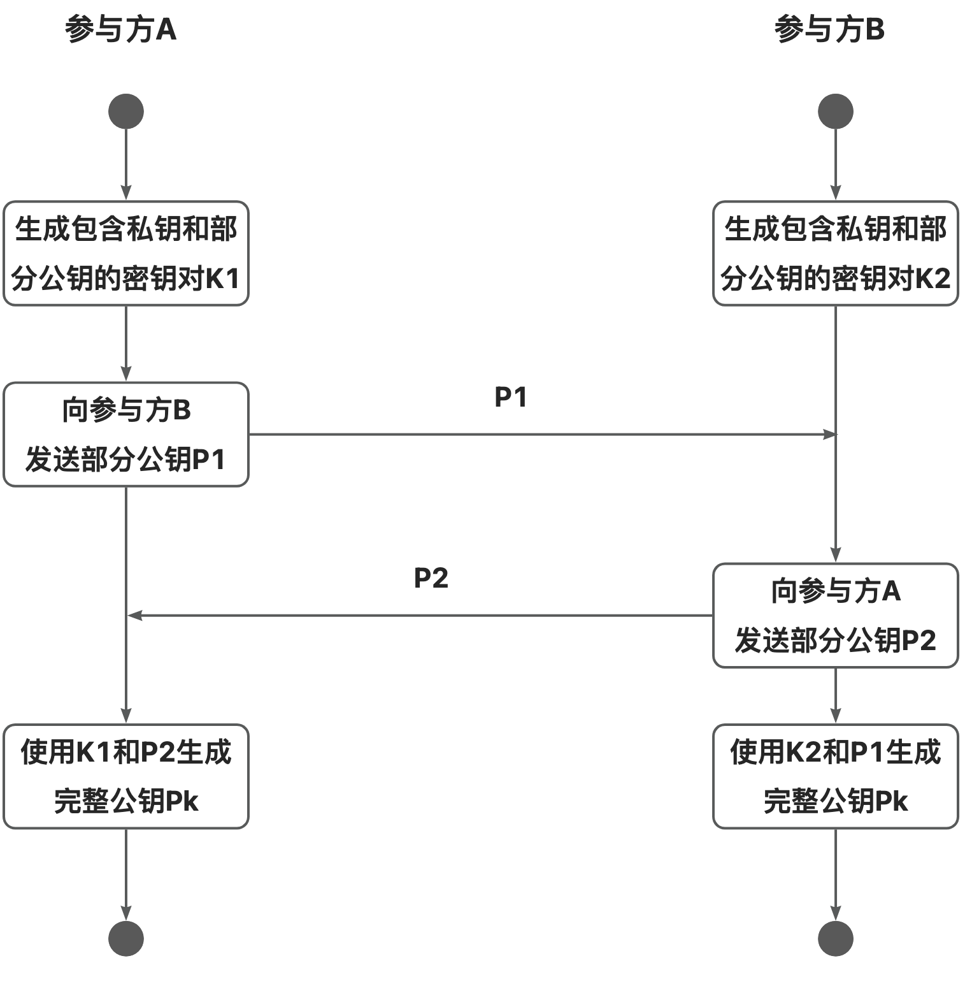

### 1 背景

数字签名是一种用于验证数据完整性和身份认证的算法。该算法基于非对称加密技术，使用签名者的私钥对数据进行签名，得到一个仅能由私钥持有者生成的签名值。验证者可以使用签名者公开的公钥对签名进行解密和验证，以确认数据的完整性和发送者的身份。自第一个签名算法RSA被提出以来，数字签名技术已经广泛应用于网络通信、证书签发、区块链等领域，成为保障信息安全的重要方法。

SM2数字签名算法是国家密码管理局于2010年发布的椭圆曲线公钥密码算法SM2的一部分，其安全性基于求解有限域上椭圆曲线离散对数问题的困难性。SM2算法已成为我国公钥算法标准GM/T 0003.2-2012，并进入国际标准ISO/IEC 14888-3:2016中。与其他数字签名算法类似，私钥泄漏是SM2数字签名算法在实际应用中的一大挑战。具体来说，一旦用户的私钥泄漏，攻击者便可以任意地伪造数字签名，窃取用户信息或伪造用户身份，对信息系统的数据安全造成极大的损害。

基于上述挑战，门限签名（Threshold Signature）的思想应运而生。门限签名算法的特点在于，不再构建一个完整的私钥，而是将私钥拆分为多个部分私钥，由不同参与方独立持有。执行签名运算时，必须由一定数量的私钥持有者参与才能够生成完整的签名值。更进一步地，由用户和可信中心共同参与的两方门限签名算法是较为常见的一种技术方案。该方案由用户和半可信的中心服务器分别掌握一份部分私钥，签名计算过程由用户和中心服务器共同参与。该方案不仅能够提升攻击者窃取密钥的难度，中心服务器也不能单独地使用部分私钥完成数字签名计算，降低了中心服务器被攻击时的私钥泄漏风险。

我们基于林璟锵老师的研究成果《SM2数字签名算法的两方门限计算方案框架》，在铜锁中实现了SM2两方门限签名算法（点击“阅读原文”跳转到对应代码）。该算法基于乘法拆分，参与方分别构造部分私钥，基于对手方的部分公钥构造完整公钥并公开；参与方独立构造签名随机数，经组合后与部分私钥和消息摘要共同完成数字签名的协作计算。该算法**无需同态加密等其他多方安全计算技术参与，通信轮次少（1轮通信），在实现难度、性能表现方面具有优势。**

### 2 算法原理

SM2两方门限签名算法要求，任意单一参与方无法独立完成密钥生成和签名计算，且任意单一参与方无法从交互过程中获取完整的签名私钥或另一部分私钥的任何信息。

为了达成以上要求，2个参与方应分别持有 1 个用于协作计算签名的部分私钥。在签名计算的过程中，为了保护各自的部分私钥，2个参与方应独立生成1个部分签名随机数，然后通过特定的方式协作生成完整签名随机数以计算签名值。签名过程不应泄漏关于部分签名随机数的任何信息，使任意参与方无法获取完整签名随机数，杜绝利用完整签名随机数推导出完整私钥的可能性。满足上述安全要求的SM2两方门限签名算法主要步骤如下：

#### 2.1 密钥生成

与标准的SM2算法略有不同，本算法将SM2数字签名过程中关于私钥的表达式$ (1+d)^{-1} $视为完整私钥并进行拆分。设两个参与方为$ A,B $，记SM2椭圆曲线阶数为$ n $，生成元为$ G $，持有的部分私钥分别为$ d_1, d_2 $，那么在乘法拆分下，完整私钥与$ d_1, d_2 $之间的关系满足：

$ (1+d)^{-1} = d_1 * d_2 $

故$ d = d_1^{-1}*d_2^{-1} - 1 $，完整公钥$ P_K = [d] * G = d_1^{-1}*d_2^{-1} * G - G $。此时，采用如下方式计算参与方$ A,B $的部分私钥：

1. 参与方$ A $使用安全的随机数生成源，随机生成部分私钥$ d_1 \in [1,n-1] $。
2. 参与方$ B $使用安全的随机数生成源，随机生成部分私钥$ d_2 \in [1,n-1] $。

为了获得完整公钥$ P_K $供验签时使用，参与方$ A,B $需要通过 **1**轮通信以构造$ P_K $：

1. 参与方$ A $计算部分公钥$ P_1 = d_1^{-1} * G $，并发送给参与方$ B $
2. 参与方$ B $计算部分公钥$ P_2 = d_2^{-1} * G $，并发送给参与方$ A $
3. 参与方$ A $使用获得的部分公钥$ P_2 $，计算完整公钥$ P_K = d_1 ^{-1} * P_2 - G = d_1^{-1}*d_2^{-1} * G - G $
4. 参与方$ B $使用获得的部分公钥$ P_1 $，计算完整公钥$ P_K = d_2 ^{-1} * P_1 - G = d_1^{-1}*d_2^{-1} * G - G $

基于椭圆曲线离散对数问题的困难性可知，任意参与方无法通过另一参与方发送的部分公钥推导出相应的部分私钥，因此密钥生成过程不会造成部分私钥的泄漏。

#### 2.2 门限签名

在标准SM2算法中，签名者需要生成一个随机数$ k $以计算随机椭圆曲线点$ Q= (x_1,y_1) = [k]*G $。如果随机数$ k $仅由一方生成，那么在计算签名参数$ s $时会造成部分私钥的泄漏。因此，随机数$ k $需要由两方协作生成，且签名过程不应泄漏随机数的信息，步骤如下：

1. 参与方$ A $计算消息$ m $的摘要$ e $。
2. 参与方$ A $随机生成部分签名随机数$ w_1 \in [1,n-1] $，计算$ Q_1 = [w_1] * G $，将摘要$ e $和$ Q_1 $发送给参与方$ B $。
3. 参与方$ B $随机生成部分签名随机数$ w_2 \in [1,n-1] $，计算完整的随机椭圆曲线点$ Q = [w_2]*G + d_2^{-1} * Q_1 $。
4. 参与方$ B $计算$ r = (x_1 + e) \mod q $，$ s_1 = d_2 * (r + w_2) \mod q $，将$ (r,s1) $包装为部分签名$ sig_1 $发送给参与方A。
5. 参与方$ A $计算$ s = (d_1 * (s_1 + w_1) -r)\mod q $，$ (r,s) $即为最终的门限签名结果。

上述签名过程需要 **1**轮通信以协作生成门限签名值。观察到，在步骤2、3中，随机数$ w_1,w_2 $以基点乘法的形式对外公开。由于椭圆曲线离散对数问题的困难性，攻击者无法通过公开信息获取随机数$ w_1,w_2 $；在步骤4、5中，与部分私钥$ d_1,d_2 $相关的表达式均包含2个无法被攻击者或另一参与方掌握的未知数，从这 表达式中获取部分私钥$ d_1,d_2 $和随机数$ w_1,w_2 $的难度等同于穷举，在SM2参数非常大的条件下，可视为无法通过常规计算得出。综上所述，门限签名的过程不会造成随机数与部分私钥的泄漏。

#### 2.3 验签

**本算法的验签过程与标准SM2算法完全一致。**任何人都可以通过公开的完整公钥$ P_K $验证门限签名的合法性。完整的签名过程可参见国标GM/T 0003.2-2012.2 的相关内容。

### 3 功能实现

根据第二章所述的算法原理，结合铜锁项目的实际架构，我们抽象出如下图所示的关于SM2门限密钥对生成和SM2门限签名的流程图：



图1：计算SM2门限签名值流程图



图2：生成SM2门限密钥对流程图

根据上述流程图，铜锁在SM2两方门限算法的实现过程中对算法框架进行了合理拆分，旨在令用户调用单个函数即可完成流程图中的某一完整阶段。具体来说：

1. 生成部分密钥对时，用户使用现有EVP相关函数生成部分私钥，然后调用`SM2_THRESHOLD_derive_partial_pubkey`函数生成部分公钥；
2. 收到另一方的部分公钥后调用`SM2_THRESHOLD_derive_complete_pubkey`生成完整密钥对；计算签名值时，根据数据类型的不同两个参与方交替调用流式处理`SM2_THRESHOLD_sign1_init``SM2_THRESHOLD_sign1_update``SM2_THRESHOLD_sign1_final`或一次性处理`SM2_THRESHOLD_sign1_oneshot`进行步骤1的处理；
3. 最后使用`SM2_THRESHOLD_sign2`和`SM2_THRESHOLD_sign3`函数完成协作签名的生成。

具体的函数用途说明、参数和返回值定义，可以通过点击“阅读原文”跳转到对应Pull Request后，查看代码中的头文件获得。本文中仅给出本次增加的全部API原型：

```c
EVP_PKEY *SM2_THRESHOLD_derive_partial_pubkey(const EVP_PKEY *key);

EVP_PKEY *SM2_THRESHOLD_derive_complete_pubkey(const EVP_PKEY *self_key,
                                               const EVP_PKEY *peer_pubkey);

int SM2_THRESHOLD_sign1_oneshot(const EVP_PKEY *pubkey,
                                const EVP_MD *type,
                                const uint8_t *id,
                                const size_t id_len,
                                const uint8_t *msg, size_t msg_len,
                                uint8_t *digest, size_t *dlen);

int SM2_THRESHOLD_sign1_init(EVP_MD_CTX *ctx, const EVP_MD *digest,
                             const EVP_PKEY *pubkey, const uint8_t *id,
                             const size_t id_len);

int SM2_THRESHOLD_sign1_update(EVP_MD_CTX *ctx, const uint8_t *msg,
                               size_t msg_len);

int SM2_THRESHOLD_sign1_final(EVP_MD_CTX *ctx, uint8_t *digest,
                              size_t *dlen);

int SM2_THRESHOLD_sign2(const EVP_PKEY *key,
                        const EVP_PKEY *peer_Q1,
                        uint8_t *digest, size_t dlen,
                        unsigned char **sig, size_t *siglen);

int SM2_THRESHOLD_sign3(const EVP_PKEY *key, const EVP_PKEY *temp_key,
                        const unsigned char *sig2, size_t sig2_len,
                        unsigned char **sig, size_t *siglen);
```

### 4 配置与使用

在铜锁中，SM2两方门限签名功能需通过配置选项`enable-sm2_threshold`开启。另外，如果系统支持，建议开启铜锁针对64位平台实现的SM2性能优化开关`enable-ec_sm2p_64_gcc_128`：

```bash
./config --prefix=/opt/tongsuo -Wl,-rpath,/opt/tongsuo/lib enable-sm2_threshold enable-ec_sm2p_64_gcc_128
```

为了降低门限签名的使用门槛，铜锁相应地实现了SM2两方门限签名的命令行工具，通过命令行就可以非常方便地体验和测试SM2两方门限签名。

我们接下来用一个例子来演示命令行工具的用法。假设参与的两方为Alice和Bob，双方均持有自己的部分私钥，并最终协同生成完整签名。具体步骤是：

#### 4.1 门限密钥对生成

1. Alice和Bobo各生成自己的部分私钥，分别存储至文件`A.key``B.key`中，并基于部分私钥导出对应的部分公钥，存储在`A.pub`和`B.pub`中

```bash
Alice:
genpkey -algorithm "ec" -pkeyopt "ec_paramgen_curve:sm2" -out A.key
sm2_threshold -derive -inkey A.key -pubout A.pub

Bob:
genpkey -algorithm "ec" -pkeyopt "ec_paramgen_curve:sm2" -out B.key
sm2_threshold -derive -inkey B.key -pubout B.pub
```

2. Alice将自己的部分公钥`A.pub`发送给Bob；Bob将自己的部分公钥`B.pub`发送给Alice。然后Alice和Bob可以合成完整公钥`pubkey.pem`，后续使用此完整公钥进行验签。

```bash
Alice:
tongsuo sm2_threshold -inkey A.key -peerkey B.pub -pubout pubkey.pem

Bob:
tongsuo sm2_threshold -inkey B.key -peerkey A.pub -pubout pubkey.pem
```

3. 至此，Alice和Bob完成了相关密钥的准备工作，可以协同进行门限签名。

#### 4.2 两方门限签名计算

1.  假设Alice是门限签名的发起方，那么她需要生成一个随机内容的文件`file`做为原文：

```bash
dd if=/dev/urandom of=file bs=1024 count=1
```

2. Alice首先执行门限签名的第一步，即针对待签名内容`file`进行摘要计算并生成一个临时的私钥`tempA.key`以及对应的临时公钥`tempA.pub`。然后Alice将此命令输出的摘要值保存为`dgst`文件并将其和`tempA.pub`一同发送给Bob。

```bash
tongsuo sm2_threshold -sign1 -newkey tempA.key -pubout tempA.pub -pubin -inkey pubkey.pem -in file
```

3. Bob在收到`dgst`和`tempA.pub`后，开始执行第二步，即使用Alice的临时公钥`tempA.pub`和自己的部分私钥`B.key`，基于消息的摘要值`dgst`，生成部分签名值`partial_sig.txt`。然后Bob将`partial_sig.txt`发送给Alice：

```bash
tongsuo sm2_threshold -sign2 -inkey B.key -temppeerkey tempA.pub -digest dgst -sigform hex -out partial_sig.txt
```

4. Alice在收到部分签名值`partial_sig.txt`后，执行第三步，即使用自己的部分私钥`A.key`，临时私钥`tempA.key`和部分签名值`partial_sig.txt`，生成完整签名值，并输出至文件`final_sig.txt`：

```bash
tongsuo sm2_threshold -sign3 -inkey A.key -sigform hex -sigfile partial_sig.txt -tempkey tempA.key -out final_sig.txt
```

5. 任何人可以使用完整公钥，对文件`file`和签名`final_sig.txt`，验证签名结果。此步骤和验证标准SM2签名值无异，因此就不再赘述，读者可自行查阅相关文档。

### 5 性能指标

与标准SM2数字签名算法相比，铜锁实现的SM2两方门限签名算法需要2个参与方共同完成密钥对的生成和签名值的计算，涉及到的算法流程更加复杂，所需的椭圆曲线运算较标准SM2算法更多。具体来看，在密钥对生成环节，SM2两方门限签名算法相较于标准算法平均每个密钥对需要多执行**1次曲线点乘和1次模逆元计算**；在协同签名环节，计算每个签名值需要多执行**1次曲线点乘和1次曲线基点乘计算**，但可以省去**1次模逆元计算**；验签过程与标准算法一致。

从上述分析结果来看，SM2两方门限签名算法的验签性能应与标准算法接近，签名和密钥生成的性能会有一定的退化，且稍弱于验签性能。为了验证上述判断，铜锁测试了在**开启SM2-64位平台优化**下的SM2两方门限签名算法性能（纯算法性能，不包含通信开销），并与标准SM2数字签名算法进行比较，得到测试结果如下表所示：

|                       |  签名   |  验签   | 密钥对生成 |
| --------------------- | :-----: | :-----: | :--------: |
| SM2两方门限签名算法   | 7473/s  | 10579/s |   7317/s   |
| 标准SM2算法（无优化） | 5970/s  | 6176/s  |   5161/s   |
| 标准SM2算法（有优化） | 23277/s | 12193/s |  15773/s   |

测试结果与预期一致，验签性能与标准SM2算法接近，密钥对生成和签名性能略低于验签性能。不过，所实现的SM2两方门限算法的性能依然要好于无优化的标准SM2算法，相比使用同态加密的一些门限方案性能优势更大，能够满足大多数情况下的生产环境需求。
