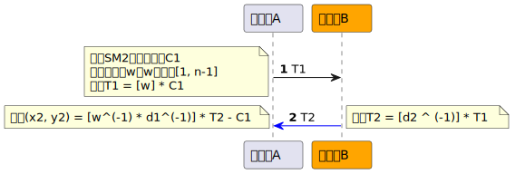
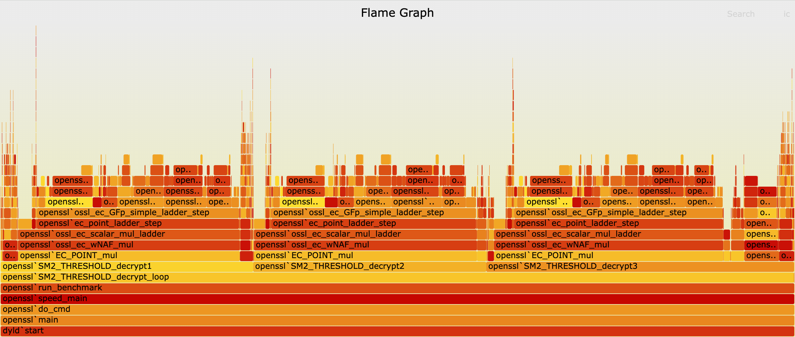

## 前言

在SM2两方门限签名算法的基础上，铜锁进一步支持了SM2两方门限解密算法。

标准SM2解密算法中输入密文和私钥，即可解密出明文。而在SM2两方门限的情况下，因为没有完整的私钥，或者说一把钥匙变成两把钥匙，即两个参与方，Alice和Bob，各自持有私钥分量，当需要进行SM2解密的时候，需要在Alice和Bob共同参与，通过一轮交互之后，即分别输入Alice和Bob各自的私钥分量，才能将密文还原成明文。

通过SM2两方门限解密算法可以提升密钥的安全性，即降低单一密钥泄漏的风险。同时也可以应用于需要两方或多个参与方共同参与计算，且对数据隐私有严格要求的场景中，例如跨机构数据分析等。

在基于铜锁源代码进行构建时，可以按需开启SM2两方门限算法的开关，即：

```bash
./config enable-sm2_threshold
```

## 算法原理

SM2门限密钥生成算法，参与方A生成自己的私钥分量d1，参与方B生成自己的私钥分量d2，然后分别推导公钥分量P1 = [d1^(-1)] * G，P2 = [d2^(-1)] * G，并将公钥分量发送给对方，参与方A推导完整公钥P = [d1^(-1)] * P2 - G，参与方B推导完整公钥P = [d2^(-1)] * P1 - G，双方推导出的完整公钥相等。详情可以参考之前的文章《铜锁支持SM2两方门限签名算法》。

加密算法与标准的SM2加密算法一致，即使用完整的SM2公钥加密即可，算法详情可以参考《GB/T 32918.4——2016 信息安全技术 SM2椭圆曲线公钥密码算法》第四部分：公钥加密算法。

### SM2两方门限解密算法



算法过程：

1. 参与方A收到SM2加密的密文后，首先解码出C1，（SM2密文结构为C1 || C3 || C2)，然后生成随机数w，w ∈ [1, n-1]。计算T1 = [w] * C1。
2. 将T1发送给参与方B。
3. 参与方B计算T2 = [d2^(-1)] * T1，d2为参与方B的私钥分量。
4. 将T2发送给参与方A。
5. 参与方A计算（x2, y2) = [w^(-1)*d1^(-1)] * T2 - C1，d1为参与方A的私钥分量；计算 t = KDF(x2 || y2, klen)，计算明文M = C2 ⊕ t，其中C2来自于SM2密文。

## 铜锁SM2门限解密API

SM2门限解密涉及3步，每一步对应铜锁的一个API，API接口原型如下，关于参数、返回值和使用说明，可以参考铜锁项目源代码和铜锁帮助文档。

```c
int SM2_THRESHOLD_decrypt1(const unsigned char *ct, size_t ct_len, BIGNUM **w,
                           EC_POINT **T1);
int SM2_THRESHOLD_decrypt2(const EVP_PKEY *key, const EC_POINT *T1,
                           EC_POINT **T2);
int SM2_THRESHOLD_decrypt3(const EVP_PKEY *key, const unsigned char *ct,
                           size_t ct_len, const BIGNUM *w, const EC_POINT *T2,
                           unsigned char **pt, size_t *pt_len);
```

## 命令行实战

首先生成SM2门限密钥，包括私钥分量、公钥分量和完整公钥。

```bash
# Alice创建私钥分量，推导公钥分量
tongsuo genpkey -algorithm ec -pkeyopt ec_paramgen_curve:sm2 -out A-sm2.key
tongsuo sm2_threshold -derive -inkey A-sm2.key -pubout A-pub.key

# Bob创建私钥分量，推导公钥分量
tongsuo genpkey -algorithm ec -pkeyopt ec_paramgen_curve:sm2 -out B-sm2.key
tongsuo sm2_threshold -derive -inkey B-sm2.key -pubout B-pub.key

# Alice推导完整的公钥
tongsuo sm2_threshold -derive -inkey A-sm2.key -peerkey B-pub.key -pubout ABpub.key

# Bob推导完整的公钥
tongsuo sm2_threshold -derive -inkey B-sm2.key -peerkey A-pub.key -pubout BApub.key

```

然后使用SM2公钥加密。

```bash
echo "hello tongsuo" > plain.txt

# 使用完整的SM2公钥加密
tongsuo pkeyutl -encrypt -pubin -inkey ABpub.key -in plain.txt -out cipher.txt

```

最后演示SM2门限密钥解密过程。

```bash
# 门限解密第1步：Alice输入密文，生成随机数w和点T1
tongsuo sm2_threshold -decrypt1 -in cipher.txt -newrand w.bin -newpoint T1.bin

# 门限解密第2步：Bob输入自己的私钥分量和点T1，生成点T2
tongsuo sm2_threshold -decrypt2 -inkey B-sm2.key -pointin T1.bin -pointout T2.bin

# 门限解密第3步：Alice输入自己的私钥分量、第一步生成的随机数w、点T2，以及密文，解密出明文。
tongsuo sm2_threshold -decrypt3 -inkey A-sm2.key -randin w.bin -pointin T2.bin -in cipher.txt -out plain2.txt
```

## 性能测试

SM2两方门限解密相比标准的SM2解密算法，交互次数多了2次，核心运算多了2次非固定点的点乘运算。在不考虑网络交互消耗的情况下，使用铜锁speed测试标准的SM2加解密和SM2门限解密，测试环境和测试数据如下。

测试环境：

+ 操作系统：macOS 13.6.3
+ 处理器：Apple M2 Pro
+ 内存：16G
+ 编译器：Apple clang version 14.0.3 (clang-1403.0.22.14.1) / Target: arm64-apple-darwin22.6.0

| 块大小（Bytes） | SM2加密  | SM2解密  | SM2门限解密 |
| -------------------- | -------- | -------- | ----------- |
| 16                   | 21.09k   | 41.77k   | 12.91k      |
| 64                   | 84.82k   | 167.39k  | 51.61k      |
| 128                  | 168.98k  | 331.68k  | 102.70k     |
| 256                  | 334.60k  | 650.22k  | 204.20k     |
| 512                  | 654.60k  | 1244.61k | 402.90k     |
| 1024                 | 1258.11k | 2309.84k | 785.52k     |

根据测试数据可以看出，SM2门限解密算法相对于标准SM2解密算法性能下降2/3左右，即标准的SM2解密性能是SM2门限解密算法的三倍左右。

同时使用性能分析工具输出火焰图，如下图所示。可以看到主要的性能消耗在EC_POINT_mul()，即3次椭圆曲线的点乘运算。通过实际的火焰图展示，可以验证speed性能测试数据和性能消耗的理论分析基本一致。


