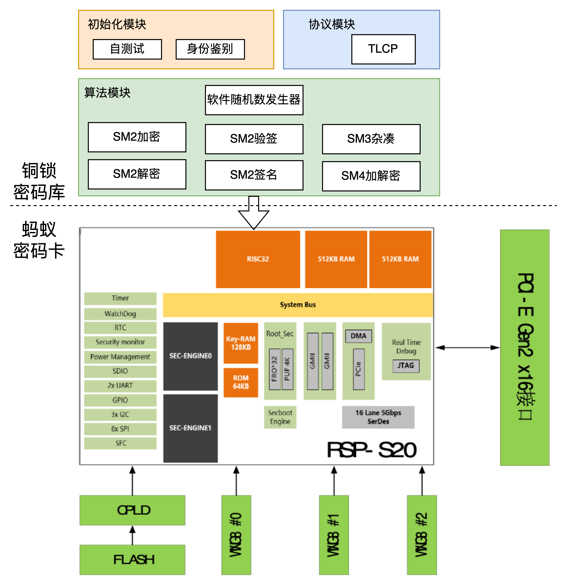

近日，蚂蚁集团密码团队基于开源铜锁项目和蚂蚁集团自研的密码卡，获得了国家密码管理局商用密码检测中心颁发的商用密码产品认证证书，符合 **GM/T 0028《密码模块安全技术要求》安全二级**。采用软硬件结合的方案，即混合软件密码模块，助力用户在国密改造、密评、等保等过程中，更加严谨地满足我国商用密码技术合规的要求。

## 关于商用密码产品认证

我国于 2020 年实施了《中华人民共和国密码法》（以下简称密码法），标志着密码技术的应用进入了依法管理的时代。《密码法》规定，我国的密码实行分类管理，即核心密码、普通密码和商用密码。核心密码和普通密码用于保护国家秘密信息，商用密码则用于保护不属于国家秘密的信息。当前，商用密码已经广泛应用于政务、金融、通信、交通、医疗、能源等各领域，为社会经济发展提供了有力的安全保障。

《密码法》提出推进商用密码检测认证体系建设，制定商用密码检测认证技术规范、规则，鼓励商用密码从业单位自愿接受商用密码检测认证，提升市场竞争力。商用密码检测、认证机构应当依法取得相关资质，并依照法律、行政法规的规定和商用密码检测认证技术规范、规则开展商用密码检测认证。要求对关键信息基础设施的密码应用安全性开展分类分级评估。《网络安全法》也明确规定关键信息基础设施运营者每年要自行或者委托第三方机构对信息系统安全性进行测评。密码应用安全性是测评的一项重要内容，应遵循密码法律法规要求。

商用密码检测机构针对生产厂家提交的商用密码产品，按照不同产品类别的相关要求，进行技术合规方面的多重检测。检测通过后，由检测机构为商用密码产品颁发《商用密码产品认证证书》，其中注明是基于何种产品标准和技术要求进行的检测，例如对于密码模块类型的商用密码产品，则需要符合 **GM/T 0028《密码模块安全技术要求》** 的各项规范。

《商用密码产品认证证书》是一种资质，表明了获得证书的商用密码产品在经过相关检测机构严格的测试后，在技术正确性、兼容性等方面是符合规范要求的，因此可以为使用该商用密码产品的用户提供更加严谨和正式的监管合规支撑，例如在密评、等保等认证体系中，均对密码相关产品或服务提出了相关资质的要求。

由于业内对于商用密码通常简称为 “国密”，因此《商用密码产品认证证书》也俗称为 **“国密资质”**。

## 铜锁 + 蚂蚁卡，软硬件结合

**关于铜锁**

> 铜锁（Tongsuo）是一个提供现代密码学算法和安全通信协议的开源基础密码库，为存储、网络、密钥管理、隐私计算等诸多业务场景提供底层的密码学基础能力，实现数据在传输、使用、存储等过程中的私密性、完整性和可认证性，为数据生命周期中的隐私和安全提供保护能力。  
> 铜锁开源项目已经由蚂蚁集团完成了向**开放原子开源基金会**的捐赠，成为基金会的“孵化期”项目，也是基金会唯一的密码学方向开源项目。在基金会孵化过程中，铜锁开源社区先后启动了 **“铜锁嵌入式版”** 和 **“RustyVault密钥管理系统”** 两个新项目的开发。蚂蚁集团在铜锁完成捐赠后持续对项目进行投入，成立了铜锁项目管理委员会，引入多家领军企业参与铜锁开源项目的管理，推动铜锁进入到了独立发展的新阶段。  
<!-- > 了解更多信息请移步铜锁官网[https://www.tongsuo.net/](https://www.tongsuo.net/)。 -->

采用软硬件结合的方式申请二级密码模块，利用蚂蚁卡的密码管理能力和高性能优势，结合铜锁密码库提供的算法API、国密安全传输协议（TLCP）和硬件引擎框架，为应用程序提供数据安全能力。

支持常用的国密算法，包括 SM2、SM3 和 SM4。具体的安全功能包括 SM2 加密和解密、SM2 签名和验签、SM3 杂凑、SM4 对称加解密、软件随机数发生器、国密传输 TLCP 通信功能（包括客户端和服务端）。

## 开源计划

二级密码模块中涉及的软件部分（非密码卡相关代码），会全部回馈给开源社区，将于近期内合并到铜锁开源项目中。
未来，铜锁开源项目也会适配更多的密码硬件，同时也欢迎跟更多的密码设备厂商合作，基于铜锁开源项目和密码硬件，共同打造安全、合规的解决方案，满足企业国密改造、密评、等保等场景下的技术合规要求。
