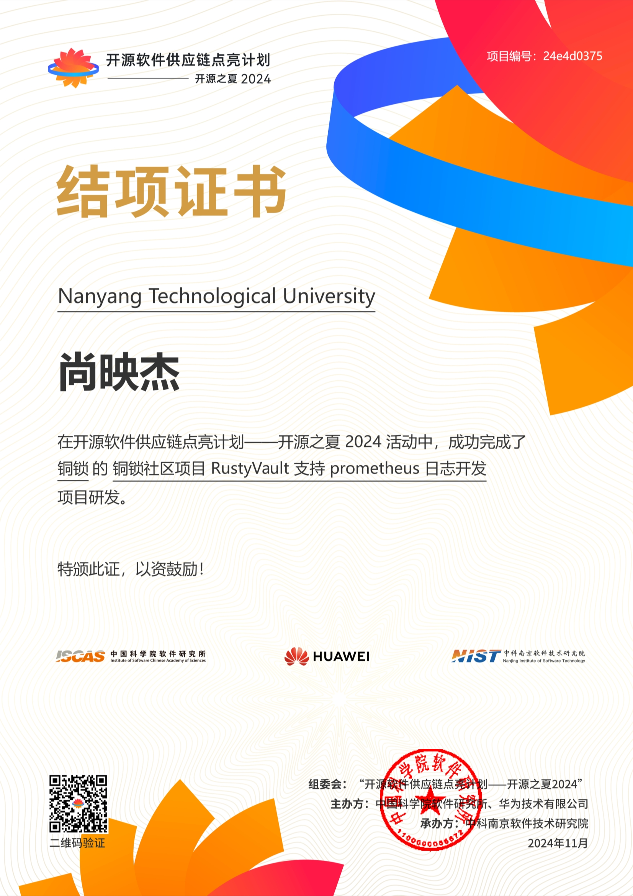

开源之夏是中国科学院软件研究所发起的“开源软件供应链点亮计划”系列暑期活动，旨在鼓励高校学生积极参与开源软件的开发维护，促进优秀开源软件社区的蓬勃发展。活动联合各大开源社区，针对重要开源软件的开发与维护提供项目开发任务，并向全球高校学生开放报名。开源之夏搭建了开源社区和高校开发者的桥梁，培养和发掘更多优秀的开发者，共筑开源软件可靠供应链。

2024年，铜锁开源社区很荣幸再次参加开源之夏活动，一共发布了2个项目，项目简介如下。

| 项目名称                                      | 社区导师 | 编程语言 | 仓库地址                                                     |
| --------------------------------------------- | -------- | -------- | ------------------------------------------------------------ |
| 铜锁社区项目RustyVault支持prometheus 日志开发 | 王祖熙   | Rust     | [https://github.com/Tongsuo-Project/RustyVault](https://github.com/Tongsuo-Project/RustyVault) |
| 铜锁密码库Go语言SDK国密算法和协议开发         | 张成龙   | Golang   | [https://github.com/Tongsuo-Project/tongsuo-go-sdk](https://github.com/Tongsuo-Project/tongsuo-go-sdk) |

在项目申请阶段，有多组学生提交项目申请，最终尚同学和张同学通过终选。在项目导师的指导下，明确项目需求，独立完成开发任务。经过几个月的努力，顺利结项，感谢2位同学的辛勤付出。

开源之夏今年有455位同学通过了结项审核，为进一步鼓励这些新生的开源力量，组委会特邀请指导委员会老师从最佳质量奖、突出贡献奖、最快进步奖、最具潜力奖4个方向评选出具有代表性的 20 位优秀学生。其中，尚同学在“RustyVault支持Prometheus日志开发”项目中表现卓越，由于其学习能力强，迅速掌握了Rust语言以及Prometheus的仪表化技术，技术基础扎实，在面对复杂项目时，能运用科学方法解决问题，从众多同学中脱颖而出，荣获“最具潜力奖”。

开源之夏活动已经举办多年，每一届都为开源社区输入新鲜血液。开源社区需要年轻开发者的参与和贡献，而越来越多的学生也逐渐成为了开源社区的主力军。同样，铜锁开源社区需要开源力量，希望更多的学生参与进来，一起构建安全、合规、易用的开源密码库。
