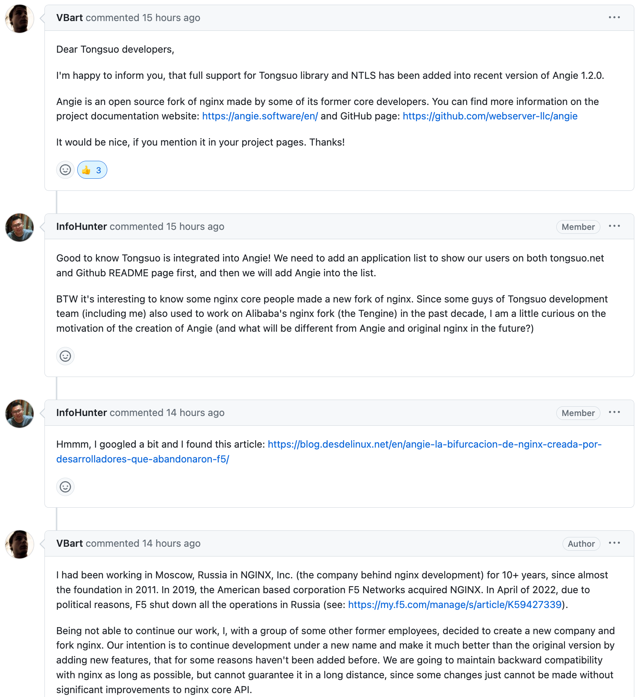
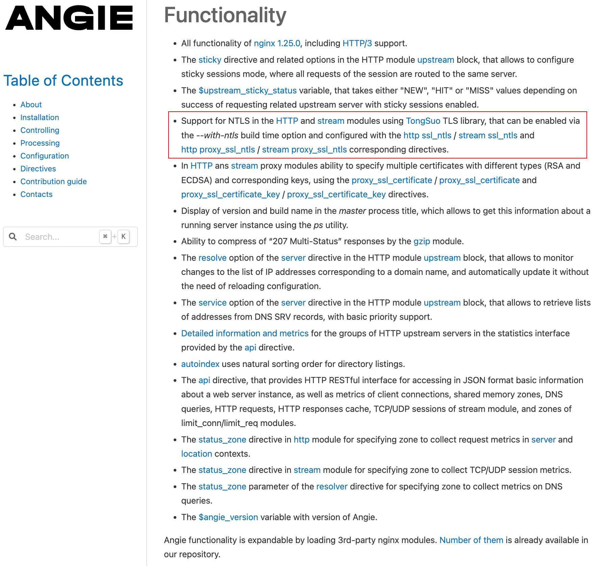

# Nginx 衍生版 Angie 支持铜锁和国密功能

## 背景

近日，铜锁社区收到 Angie 核心成员 VBart (真名：Valentin V. Bartenev) 的来信，他很高兴地说，Angie 已经支持了铜锁库和国密功能，希望我们在铜锁项目主页上『互粉』一下。这让我们欣喜万分，因为我们之前尝试去让 Nginx 支持铜锁和国密，但由于 Nginx 被 F5 收购之后就不那么 open 了，此事就没了后续，而今天了解到 Angie 是 Nginx 的几个核心成员 fork Nginx 的衍生版，因为 F5 是美国公司，由于政治原因关闭了俄罗斯的业务，所以 Nginx 的核心成员就出去创业了自己的公司，开始开发 Angie，也算是延续 Nginx 的生命吧。同时，也让我们意识到，解决卡脖子问题刻不容缓。另外，也想不到一个俄罗斯软件会主动来集成铜锁和支持国密，我想这可能是开源社区的魅力吧。
下面是 VBart 来信的原文截图：



## 关于 Angie

从 Angie 官网了解到，Angie 是一个高效、强大和可扩展的 Web 服务器，由一些以前的 Nginx 核心开发人员从 Nginx fork 而来，旨在扩展远远超出 Nginx 的功能。

Angie 是 Nginx 的直接替代品，因此可以使用现有的 Nginx 配置而无需进行重大更改。

Angie 代码仓库在 github 上：[https://github.com/webserver-llc/angie](https://github.com/webserver-llc/angie)

目前 Nginx 衍生版众多，一些公司可能有自己的定制改动，有的开源有的闭源，无法直接用 Angie 平替，但国密功能可以参考 Angie 的实现：

http 模块支持国密的commit：[https://github.com/webserver-llc/angie/commit/05a23ccbd72afd59ef407f7881707133154d0a1b](https://github.com/webserver-llc/angie/commit/05a23ccbd72afd59ef407f7881707133154d0a1b)

stream 模块支持国密的commit：[https://github.com/webserver-llc/angie/commit/fa83ee606cf7d55910e28772f5914d773e1fb635](https://github.com/webserver-llc/angie/commit/fa83ee606cf7d55910e28772f5914d773e1fb635)

下面是 Angie 的特性截图：


Angie 更多信息请移步其官网：[https://angie.software/en/](https://angie.software/en/)

## 关于铜锁国密

铜锁国密一般指铜锁实现的国密算法和国密协议。

- 国密算法

    即国家商用密码算法，是由国家密码管理局认定和公布的密码算法标准及其应用规范，其中部分密码算法已经成为国际标准。如 SM 系列密码，SM 代表商密，即商业密码，是指用于商业的、不涉及国家秘密的密码技术。在金融领域目前主要使用公开的 SM2、SM3、SM4 三类算法，分别是非对称算法、哈希算法和对称算法。目前铜锁已经实现了 SM2、SM3、SM4 算法。

- 国密协议

    国密协议在铜锁内部叫 NTLS，在铜锁的术语中代指符合 GM/T 0024 SSL VPN 和 TLCP 协议的安全通信协议，其特点是采用加密证书/私钥和签名证书/私钥相分离的方式，有单证书和双证书模式，对应的密码套件是：ECC-SM2-WITH-SM4-SM3 和 ECDHE-SM2-WITH-SM4-SM3。

    RFC 8998 中说的国密与这里的国密协议不同，RFC 8998 中说的国密是 TLSv1.3 + 国密算法，对应的密码套件是：TLS_SM4_GCM_SM3 和 TLS_SM4_CCM_SM3，与国密协议无关。

另外，铜锁获得了国家密码管理局商用密码检测中心颁发的商用密码产品认证证书，助力用户在国密改造、密评、等保等过程中，更加严谨地满足我国商用密码技术合规的要求。资质原始文件可在铜锁网站上下载：[https://www.tongsuo.net/](https://www.tongsuo.net/)

## 使用说明

### 编译

编译 Angie 的方法与 Nginx/Tengine 一样。

使用国密需要把 openssl 替换成 Tongsuo，编译命令如下：
```bash
$ ./configure --with-openssl=../Tongsuo-8.3.0 \
            --with-openssl-opt=enable-ntls  \
            --with-ntls --with-http_ssl_module 
$ make -j
$ make install
```
注意一下：上面的配置命令中 Tongsuo-8.3.0 是源码目录，不是安装目录。

### 配置

- 开启 NTLS 功能

    ```nginx
    listen ... ssl;
    ssl_ntls  on;
    ```

- 配置国密证书

    ```nginx
    listen ... ssl;

    ssl_ntls  on;

    # dual NTLS certificate
    ssl_certificate      sign.crt enc.crt;
    ssl_certificate_key  sign.key enc.key;

    # can be combined with regular RSA certificate:
    ssl_certificate  rsa.crt;
    ssl_certificate  rsa.key;
    ```

- 配置国密套件

    ```nginx
    # 确保下面配置中有这两个套件即可
    ssl_ciphers "ECC-SM2-SM4-CBC-SM3:ECDHE-SM2-WITH-SM4-SM3";
    ```

- 配置国密回源

    ```nginx
    location /proxy {
        proxy_ssl_ntls  on;

        proxy_ssl_certificate      sign.crt enc.crt;
        proxy_ssl_certificate_key  sign.key enc.key;

        proxy_ssl_ciphers "ECC-SM2-WITH-SM4-SM3:ECDHE-SM2-WITH-SM4-SM3:RSA";

        proxy_pass https://backend:443;
    }
    ```

stream 模块配置类似。

更详细的说明请移到 Angie 文档中心：
- [https://angie.software/en/http_ssl/#ssl-ntls](https://angie.software/en/http_ssl/#ssl-ntls)
- [https://angie.software/en/http_proxy/#proxy-ssl-ntls](https://angie.software/en/http_proxy/#proxy-ssl-ntls)
- [https://angie.software/en/stream_ssl/#s-ssl-ntls](https://angie.software/en/stream_ssl/#s-ssl-ntls)
- [https://angie.software/en/stream_proxy/#s-proxy-ssl-ntls](https://angie.software/en/stream_proxy/#s-proxy-ssl-ntls)
