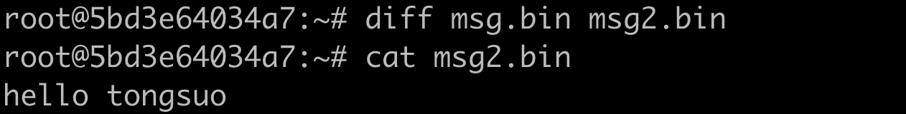

# SM2&SM3&SM4 命令行实战

## 实战 SM4 加解密

```bash
echo "hello tongsuo" > msg.bin

# SM4-CBC加密
/opt/tongsuo/bin/tongsuo enc -K "3f342e9d67d6ce7be701756af7bac8f2" -e -sm4-cbc -in msg.bin -iv "1fb2d42fb36e2e88a220b04f2e49aa13" -nosalt -out cipher.bin

# SM4-CBC解密
/opt/tongsuo/bin/tongsuo enc -K "3f342e9d67d6ce7be701756af7bac8f2" -d -sm4-cbc -in cipher.bin -iv "1fb2d42fb36e2e88a220b04f2e49aa13" -nosalt -out msg2.bin

# 比较解密的明文和原来的消息是否一样
diff msg.bin msg2.bin
```

## 实战 SM3 哈希

```bash
echo -n "hello tongsuo" | /opt/tongsuo/bin/tongsuo dgst -sm3
```

结果如下：


## 实战 SM2 签名和验签

```bash
# 生成一个随机内容文件
dd if=/dev/urandom of=msg.bin bs=1024 count=1

# SM2私钥签名，签名算法为SM2withSM3，Tongsuo/test/certs/sm2.key来自Tongsuo源代码仓库
/opt/tongsuo/bin/tongsuo dgst -sm3 -sign Tongsuo/test/certs/sm2.key -out sigfile msg.bin

# SM2公钥验签，Tongsuo/test/certs/sm2pub.key来自Tongsuo源代码仓库
/opt/tongsuo/bin/tongsuo dgst -sm3 -verify Tongsuo/test/certs/sm2pub.key -signature sigfile msg.bin

```

签名正确时，验证成功可以看到：


## 实战 SM2 加密和解密

```bash
echo "hello tongsuo" > msg.bin

# 使用SM2公钥加密，Tongsuo/test/certs/sm2pub.key来自Tongsuo源代码仓库
/opt/tongsuo/bin/tongsuo pkeyutl -inkey Tongsuo/test/certs/sm2pub.key -pubin -encrypt -in msg.bin -out cipher.bin

# 使用SM2私钥解密，Tongsuo/test/certs/sm2.key来自Tongsuo源代码仓库
/opt/tongsuo/bin/tongsuo pkeyutl -inkey Tongsuo/test/certs/sm2.key -decrypt -in cipher.bin -out msg2.bin

# 比较明文和解密后是否一致
diff msg.bin msg2.bin
```


