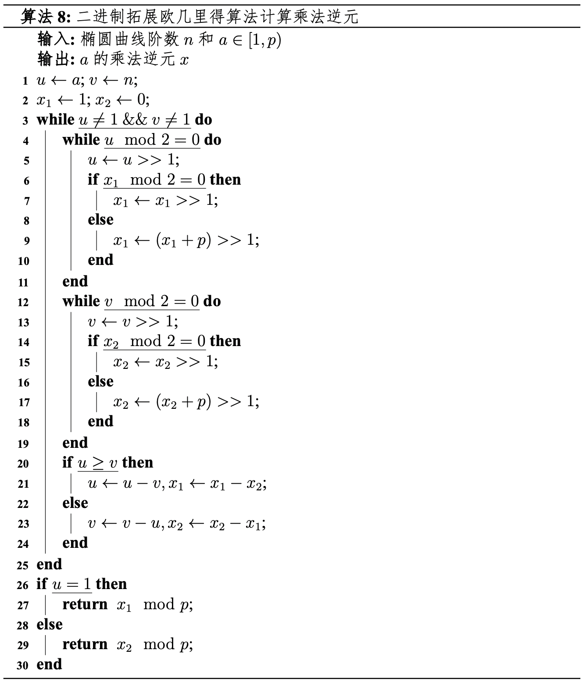

# 铜锁SM2算法性能优化实践：（三）快速模逆元算法实现

## 模逆元的概念

在数学上，乘法逆元有一个更加广为人知的别名，“倒数”。也就是说，对于实数$a$，其倒数$a^{-1}$满足$a * a^{-1} =1$。由于1是实数域的乘法单位元，故而倒数$a^{-1}$为实数$a$的乘法逆元。
而在有限域模运算中，乘法逆元的定义要更复杂一些：**如果**$a$**和**$m$**都是正整数且满足**$gcd(a,m)=1$**，那么在模**$m$**意义下，存在一个整数**$b$**，使得**$ab \equiv 1 \pmod{m}$**，此时**$b$**就是**$a$**在模**$m$**运算下的逆元，常表示为**$a^{-1}$**，简称为模逆元。**由于引入了模运算，在实数域上简单求倒数获得逆元的方法并不能直接求得有限域上的模逆元，需要改用更为复杂的方式求解运算结果。
在SM2数字签名算法中，存在两个必须计算模逆元的步骤：一是将椭圆曲线公钥点$P_K$由仿射坐标转化为雅可比坐标时，需要计算$z$轴坐标$z_1$对素数域参数$p$的模逆元，二是在签名计算过程中，需要求解私钥$d_A + 1$对椭圆曲线阶数$n$的模逆元。由于模逆元的计算非常复杂，是椭圆曲线中开销最大的单体运算（无任何优化时计算耗时是模乘法的数千倍），且运算处于数字签名算法流程的关键链路上， 因此是制约SM2数字签名性能的瓶颈之一。目前，铜锁项目为SM2数字签名算法提供了通用的模逆元优化实现，尚未针对SM2曲线实现特定优化，存在可以进一步优化提升的空间。

## 优化方案比较选型

在数学上，有两种算法可以快速地计算模逆元，它们分别是**拓展欧几里得算法**和**基于费马小定理的求解算法**。下面我们简要介绍这两类算法，讨论各算法的优缺点以及在铜锁的工程实现中选择基于费马小定理的求解算法的原因。

### 拓展欧几里得算法求解模逆元

用于求解最大公约数的欧几里得算法最早在欧几里得的《几何原本》中被提出，拓展欧几里得算法是对这一古老算法的扩展。在求解最大公约数的基础上，拓展欧几里得算法通过收集辗转相除过程中的余式，求得线性方程$ax + by = gcd(a, b)$的整数解。由于阶数$n$是一个质数，因此$gcd(a, n) = 1$，那 么该线性方程即转化为$ax + ny = 1$，恰巧是同余线性方程 $ax \equiv 1 \pmod{n}$ 的一般表示形式，所求的$x$即为$a$的模$n$逆元。 
对于现代计算机而言，拓展欧几里得算法的一个缺点是在计算过程中存在大量除法运算，而CPU在处理除法运算时的效率通常比其他基本运算（如加、减、乘）要低得多。针对这一缺陷，约瑟夫 · 斯提芬于1967年提出了[二进制拓展欧几里得算法](https://www.sciencedirect.com/science/article/abs/pii/0021999167900472?via%3Dihub), 该算法用简单的移位操作和减法代替了复杂的除法运算。 下面是利用二进制拓展欧几里得算法求模$n$逆元的伪代码：



拓展欧几里得算法求解模逆元的优点是：**可以求解任意模数下的逆元**，不受模数是否为素数的限制；算法效率高，相较于费马小定理求模逆元有一定的**性能优势**。但是，拓展欧几里得算法相应的也存在一些缺点：**实现代码较为复杂**，容易出错；代码中有大量的分支和判断语句，**难以实现恒定时间（Constant time）算法**，对于侧信道攻击的抵抗较弱，在密码学算法中可能会导致关于私钥或明文的信息发生泄漏。

### 费马小定理求解模逆元

费马小定理（Fermat's little theorem）是数论中的一个重要定理，最早由数学家费马于1636年提出。定理的内容是：假如$a$是一个整数，$p$是一个质数，那么有：
$a^p \equiv a \pmod{p}$
在SM2曲线中，数$a$和参数$n,p$满足$a < p$，$n < p < 2n$，且$p$和$n$均为素数，因此数$a , n , p$三者两两互质。此时，费马小定理有如下形式：
$a^{p-1} \equiv 1 \pmod{p}$
数$a ,p$互质，那么有 $ax \equiv 1 \pmod{n}$，联立可得：
$a^{p-2} \equiv a^{-1} \pmod{p}$
$x \equiv a^{p-2} \pmod{p}$
也就是说，若要计算数$a$对素数$p$的模逆元$x$，只需要求解 $a ^{p-2} \mod p$即可。借助费马小定理的转换，模逆元求解的过程即转化为使用模乘与模平方运算构造$a^{p-2}$的过程，大大简化了计算。
运用费马小定理求解模逆元的优点是：**算法简单**，运算过程只需要模乘与模平方运算参与，没有进位和分支操作，很**容易实现恒定时间算法**，在**抵抗侧信道攻击**方面相较于拓展欧几里得算法有较大优势；相应地，运用费马小定理求解模逆元的缺点有：**适用范围较窄**，只适用于模数为素数的情况；模数较大时，需要计算的幂次比较大，相较于使用拓展欧几里得算法求解模逆元的**性能稍劣**。

### 方案选型

在铜锁中，SM2数字签名算法的快速模逆元优化实现最终选择了基于费马小定理求解模逆元的算法，主要原因有以下两点：

1. 作为铜锁国密通信协议、国密证书签发等关键应用的基础，SM2数字签名算法在实现时应尤其注意安全性，特别是在抗侧信道攻击方面，应精心设计以避免私钥泄露；基于费马小定理求解模逆元的算法在设计恒定时间算法、抵抗侧信道攻击方面有较大优势。
2. 费马小定理求模逆元的一些缺点在SM2算法的优化实现中能够有效规避。例如，SM2曲线的参数$n,p$均为素数，满足费马小定理只适用于模数为素数的条件；对于性能问题，在具体实现时，可以通过加法链构造$a^{p-2}$减少计算模逆元所需的模乘与模平方运算次数，弥补费马小定理求逆的些许性能劣势。

## 算法实现

本文以SM2素数域模逆元求解为例，介绍费马小定理求解模逆元的具体实现。这里首先给出SM2素数域参数$p$：
    					$p_{sm2p256} = 2^{256} − 2^{224} - 2^{96} + 2^{64} - 1$
由费马小定理可得，若要计算正整数$a$对模数$p$的逆元$a^{-1}$，只需计算：
$a^{2^{256} − 2^{224} - 2^{96} + 2^{64} - 3} \pmod{p}$
该数的幂次非常大，如果采用常规方式构造，效率极低，这里我们采用加法链的思想以实现快速求幂。加法链求幂是一种快速求幂的方法，它的基本思想是将指数按二进制分解，并将幂运算分解为多个小幂数相乘的形式，从而减少幂运算的次数。前文提到，费马小定理求解模逆元的运算过程可以分解为模乘法和模平方运算，这里我们记模乘法次数为$xM$，模平方次数为$yS$，那么加法链求幂的时间复杂度可以用$xM + yS$来衡量。
尽管使加法链求幂时间复杂度最优的问题是一个NP-hard问题，且证明某求解链路是否为最优解也非常困难，但密码学界针对常见的椭圆曲线参数已经提出了许多较优的加法链。我们通过比较同一曲线的不同加法链路和相近曲线的较优链路，再进一步比较不同方案所需的中间值数量，可以比选出一个当前最优解。目前，在针对SM2曲线参数$p$的模逆元加法链研究中，一个较优解是朱辉等人提出的[算法](https://jeit.ac.cn/cn/article/doi/10.11999/JEIT211049)，**此算法的时间复杂度为**$255M + 14S$**，需要4个变量作为中间值**，具体如下：


在计算$a^{p-2}$时，另一个需要仔细考虑的是中间值溢出问题。在本系列（二）中提到，快速模约减的输入必须小于$p^2$，由于$0 < a < p$，因此在每一次乘法或平方运算后，都需要立刻调用快速模约减函数将中间值约化到$[0,p)$范围内，以避免中间值溢出导致结果出错的情况。最终铜锁实现的快速模逆元算法如下所示：
```c
static void felem_inv(felem out, const felem in)
{
    felem t0, t1, t2, t3;
    felem ftmp;
    longfelem tmp;
    unsigned i;

    /* Step 1: t0 = a^3 = (2^2 - 2^0) * a */
    felem_square(tmp, in);
    felem_reduce(ftmp, tmp);
    felem_mul(tmp, ftmp, in);
    felem_reduce(t0, tmp);
    /* Step 2: t1 = t0^2 * a = (2^3 - 2^0) * a */
    felem_square(tmp, t0);
    felem_reduce(ftmp, tmp);
    felem_mul(tmp, ftmp, in);
    felem_reduce(t1, tmp);

    /* 部分中间代码略，完整代码可见/crypto/ec/sm2p256.c*/
    
    /* Step 14: t2= ((t3^(2^32) * t0)^(2^64) * t0)^(2^94) = (2^254 - 2^222 - 2^94) * a */
    felem_assign(ftmp, t3);
    for (i = 0; i < 32; i++) {
        felem_square(tmp, ftmp);
        felem_reduce(ftmp, tmp);
    }          
    felem_mul(tmp, ftmp, t0);
    felem_reduce(ftmp, tmp);
    for (i = 0; i < 64; i++) {
        felem_square(tmp, ftmp);
        felem_reduce(ftmp, tmp);
    }
    felem_mul(tmp, ftmp, t0);
    felem_reduce(ftmp, tmp);
    for (i = 0; i < 94; i++) {
        felem_square(tmp, ftmp);
        felem_reduce(ftmp, tmp);
    }
    felem_assign(t2, ftmp);
    /* Step 15: out = (t1 * t2)^4 * a = (2^256 - 2^224 - 2^96 + 2^64 -1) * a */
    felem_mul(tmp, t1, t2);
    felem_reduce(ftmp, tmp);
    felem_square(tmp, ftmp);
    felem_reduce(ftmp, tmp);
    felem_square(tmp, ftmp);
    felem_reduce(ftmp, tmp);
    felem_mul(tmp, ftmp, in);
    felem_reduce(out, tmp);
}

```
可以看到，最终实现的代码没有进位和分支，且代码实现时仅调用了素数域运算的乘法、平方、快速约减等函数，由于这些函数都是恒定时间的，因此最终铜锁所实现的快速模逆元函数也是恒定时间的，从算法实现层面阻止了恶意攻击者通过计时攻击获取用户私钥的可能性。

## 总结与展望

关于铜锁SM2算法性能优化实践的内容大致就是这些。在实现优化后，铜锁SM2数字签名算法的性能取得了不小的进步，在国密开源产品中处于领先地位，同时极大拉近了与国际主流非对称算法（例如ed25519、nistp256）成熟工程实现的性能差距，有利于国家商用密码在国内的进一步落地推广，实现行业信息系统安全的自主可控。
未来，铜锁还将持续追踪密码学学术界的最新动向，积极推动学术研究成果在铜锁项目中落地，为用户提供性能更优、安全性更好的安全产品。欢迎开源社区的爱好者们与我们一起，携手共建铜锁社区良好的项目生态！
