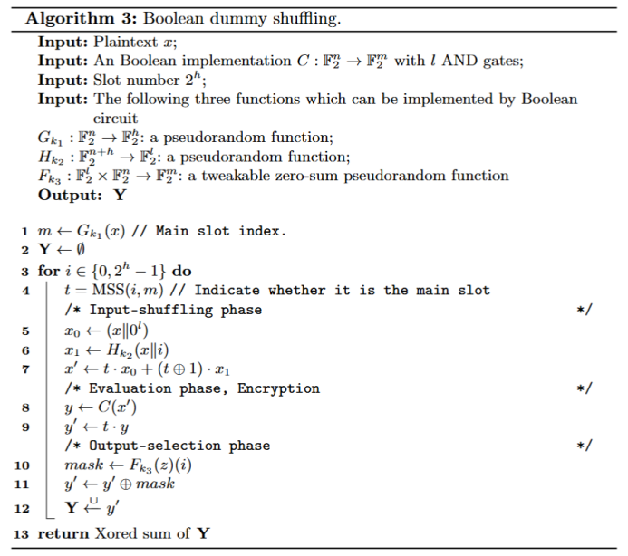

# 基于比特切片实现的虚拟洗牌保护方案的生成器研究

## 1 背景
与传统密码分析的危险信道模型不同，白盒密码学假定运行密码算法被部署在不安全的执行环境中，
攻击者对于运行密码算法的设备具备完全的掌控能力，可以通过提取代码组件、分析运行过程中产生的中间状态等方式恢复密钥。
由于其适用于移动支付、数字版权管理等商用场景，在近些年愈发受到关注。

从保护方案上来看，主流的、受到关注的白盒保护方案共分为三种：基于编码（Encode）的白盒保护方案 [1, 2]、基于高次非线性掩码（Masking）的白盒保护方案 [3] 以及基于虚拟洗牌的白盒保护方案 [4]。
而随着白盒密码的发展，编码和掩码保护方案被证明是脆弱的、容易受到差分计算分析（differential computation attack，DCA）攻击 [5, 6]。
虚拟洗牌方案是迄今为止唯一一个可以达到其所声明的安全性的方案，因此备受关注。

虚拟洗牌方案是 **WhibOx19** 白盒竞赛的三个优胜方案之一，并在欧密 2021 中由其设计者 Biryukov 和 Udovenko 公布具体细节。
它旨在对抗差分计算攻击，采用冗余操作来掩盖真实计算的值。
虚拟洗牌方案需要配合掩码方案才能达到预期的安全性。
其中，使用线性掩码即可达到预期的安全性。
值得一提的是，虚拟洗牌方案的实现效率及低，因此，在 WhibOx19 竞赛中使用者采用了比特切片（bitslice）的实现方式。
然而，公布的论文[8]中并未提及该方案的具体实现细节，只给出了该方案的伪代码，而这个伪代码本身并无法进行比特切片操作。
除此之外，论文并未公布生成器的相关代码，这使得使用虚拟洗牌方案保护密码算法在实际应用中的安全性成为了一个没有解决的难题。

### 1.1 本研究工作

基于上述考虑，本研究在 [8] 中提出的虚拟洗牌的伪代码的基础上，给出了虚拟洗牌方案的布尔电路实现方式。该实现方式可以直接使用比特切片，达到与 Biryukov 和 Udovenko 在 WhibOx 竞赛中同数量级的实现效率。
同时，本方案给出针对 SM4 商用密码标准的白盒实现程序生成器。

这一工作解决此前在工业中难以实现的虚拟洗牌方案的难题，真正落地实现了该方案在实际应用场景中的高效运行。

## 2 基础知识
### 2.1 虚拟洗牌

虚拟洗牌方案（dummy shuffling）方案包含 $N_s$ 个计算槽（slot），每个槽执行正常的加密（或解密，后续以加密为例进行描述）行为，例如 AES、SM4 等。然而，根据计算槽的输入不同被分成两类：

- 主槽（main slot）：输入为真实的明文；

- 虚拟槽（dummy slot）：输入为与明文相同长度的随机值。

每次进行计算时，主槽的未知随机选取。

该方案的具体执行流程如下：

1）输入混淆阶段：
生成 $(Ns-1)$ 个虚拟输入并与真实输入（即主槽输入）混淆。混淆后的输入记为 {p1,...,pNs}。其中，真实输入的位置 $p_m$ 是随机的，即满足概率：

$$
Pr [ p_m = i ] = 1 / N_s, i =1,2,...,N_s
$$

2)计算阶段：对于每一个索引，计算

$$
c_i = E(p_i)
$$      

其中 $E$ 为预期执行的加密函数。

3)输出选择阶段：提取主槽输出 $c_m$ 作为输出。

### 2.2 掩码

掩码（masking）是适用于侧信道防护即白盒防护中的一种重要策略，值得一提的是，虚拟洗牌方案被证明只有在结合掩码方案时才具备预期的安全性。

由于我们着重于虚拟洗牌方案的研究，因此仅介绍常用的 ISW 线性掩码方案，该方案的运行效率较高，常用作虚拟洗牌方案的补偿方案。
ISW 将运行过程中的每一个中间状态 s 拆分成 n 个比特，即 $s = s_1⊕...⊕s_n$，其中 $n$ 是一个可以被选择的参数。

### 2.3 比特切片技术

比特切片技术（bitslicing）[3]是对于基于布尔实现的软件程序的常用提升方法。该方案通过充分运用 CPU 的技能能力，通过并行计算提升对于布尔电路实现的密码算法或其他结构的运行速度。
具体来说，考虑一个布尔实现的加密电路 E 的输入为 128比特的集合 [ $x_1$ ,... , $x_{128}$]，那么，在常用的64位 CPU 上的比特切片技术如下：

**输入**：64 组待加密明文{ $x^1$,..., $x^{64}$ }。

1）**切片阶段**: 将 64 个 128 比特方案切片为 ${\tilde{x}}^i$, $i = 1, ..., 128$。

$x^1$ = [ $x^1_1$ , ... , $x^1_{128}$]

$x^1$ = [ $x^2_1$ , ... , $x^2_{128}$] = [ $\tilde{x}^1$ , ... , $\tilde{x}^{128}$ ]

...

其中 $\tilde{x}^i$ = $[ \tilde{x}^1_i, ...]^T$ 包含 64 个元素，为 64 条内存迹中第 $i$ 个元素的集合。

2）**计算阶段**:

计算 [ $\tilde{y}^1$, ... $\tilde{y}^{128}$ ] = E([ $\tilde{x}^1$, ... $\tilde{x}^{128}$ ])


3）**恢复阶段**:

将 [ $\tilde{y}^1$, ... $\tilde{y}^{128}$ ] 反切片回 64 个 $y_i$。


上述过程中的计算阶段并行计算了 64 个明文，因此运行速度达到此前的 64 倍，但是由于存在切片和恢复阶段，增加了额外的计算复杂度，因此通常情况下会存在一定的加速损失，但是计算效率也大幅度增加，通常情况下超过 60 倍。

## 3 基于布尔实现的虚拟洗牌保护方案

本实现的布尔电路构造如下。

### 3.1 核心组件：布尔选择器

该选择器的表现形式为：MSS($a$, $b$)，当 $a=b$ 时，输出1，否则输出0，构造方案如下：

------------------------------------------------------------------
**输入**：$a,b$，其中 $a_i$ 表示 $a$ 的第 $i$ 个比特。
**计算阶段**:

$t = 1$

for $i \in [1,...,n]$ do 
{ 

$t = t \cdot (a_i \oplus b_i \oplus 1)$

}

return t

------------------------------------------------------------------

利用该方案，结合虚拟洗牌设计文档中给出的伪代码，本方案的实现方式如下：



### 3.2 虚拟洗牌生成器

此生成器产生对 SM4 的虚拟洗牌白盒保护方案。
本生成器的开发基于 Biryukov 和 Udovenko 在 [3] 中给出的框架性工作。
使用的掩码为 ISW 线性掩码方案，运行过程中产生的必要随机数采用相同生成方式，其中阶数是一个可调的参数。细节如下。

### 随机数生成方法
掩码需要大量的随机数，我们采用 [3] 中提出的方法来生成它们。更准确地说，它使用伪随机函数，即 128 位线性反馈移位寄存器 (LFSR) 生成器来生成伪随机数。 LFSR 实现了本原多项式：

$$
P(x) = x^{128} \oplus x^{101} \oplus x^{40} \oplus x^{19} \oplus x^{6} \oplus x^{3} \oplus x^{1}
$$

### 输入接口
该生成器的必要输入为：SM4算法使用的密钥，需选择是加密程序还是解密程序，是否混合 boolean dummy shuffling，槽数，并行加/解密组数，掩码方案的阶数。输出为白盒加密程序。

参数调整方式如下：

```matlab
% 密钥
KEY = "samplekey1234567"
% 加解密
if_enc = 1
% 是否混合 boolean dummy shuffling
if_dummy = 1
% 槽数
slot = 2**1
% 并行加密明文组数
slice_cnt = 64

% 掩码
ct = mask_circuit(ct, MINQ(rand=rand))
ct = mask_circuit(ct, DOM(rand=rand, nshares=2))
```

### 输出程序
符合 tongsuo 使用规范的 SM4 白盒加密程序。


## 4 安全性分析及程序测试

### 4.1 安全性分析

此程序的安全性与虚拟洗牌方案相同，是迄今为止唯一一个较为有效抵抗差分计算分析及其变体的白盒保护方案。
但是该攻击无法抵抗故障注入攻击（DFA）等主动攻击。

### 4.2 运行效率测试

测试环境如下：

- CPU型号：Intel(R) Xeon(R) Gold 5317 CPUs
- Linux版本：Ubuntu 20.04

分别测试并行加密 64 组明文的比特切片实现方式，与未使用比特切片的实现：的速度比较。
经过 500,000 次测试，统计分布图及加密速度平均值，得到如下结果：

|     方案     |          未使用比特切片方案         | Xiao-Lai方案的动态白盒版本 |
| :----------: | :------------------------------: | :------------------------: |
| 代码大小      | 1.12 MB   | 1.12 MB |
| 加密速度（均值） | 6553.55 bits/s |         411020.16 bits/s          |


两种实现方式的大小基本相同。

在速度比较上，
从加密速度分布图来看，该两种方案的加密速度分布一致，实验结果可以作比较。
进一步的，从均值来看，使用 64 组并行的比特切片实现的平均速度约为此前的 62.72 倍，符合预期。


## 5 使用范例

修改密钥等必要参数的过程如 3.2 节所示。修改后，执行命令：

```matlab
./buildrun_enc.sh
```

或

```matlab
./buildrun_dec.sh
```

即可生成相应的、符合 tongsuo 使用规范的加密/解密程序。


## 参考文献
[1]Chow S ,  Eisen P A ,  Johnson H , et al. White-Box Cryptography and an AES Implementation[J]. Springer, Berlin, Heidelberg, 2002.

[2]Bringer J ,  Chabanne H ,  Dottax E . White Box Cryptography: Another Attempt[J]. Iacr Cryptology Eprint Archive, 2006.

[3]Biryukov, A, Udovenko, A, Attacks and countermeasures for white-box designs., Peyrin, T., Galbraith, S. (eds.) ASIACRYPT 2018, Part II. LNCS, vol. 11273, pp. 373–402. Springer, Heidelberg (Dec 2018)

[4]Biryukov A, Udovenko A. Dummy shuffling against algebraic attacks in white-box implementations[C]//Annual International Conference on the Theory and Applications of Cryptographic Techniques. Cham: Springer International Publishing, 2021: 219-248.

[5]Bos J W, Hubain C, Michiels W, et al. Differential computation analysis: Hiding your white-box designs is not enough[C]//Cryptographic Hardware and Embedded Systems–CHES 2016: 18th International Conference, Santa Barbara, CA, USA, August 17-19, 2016, Proceedings 18. Springer Berlin Heidelberg, 2016: 215-236.

[6]Rivain M, Wang J. Analysis and improvement of differential computation attacks against internally-encoded white-box implementations[J]. IACR Transactions on Cryptographic Hardware and Embedded Systems, 2019: 225-255.

[7]Biryukov A, Udovenko A. Dummy shuffling against algebraic attacks in white-box implementations[C]//Annual International Conference on the Theory and Applications of Cryptographic Techniques. Cham: Springer International Publishing, 2021: 219-248.

[8]Biryukov A, Udovenko A. Dummy shuffling against algebraic attacks in white-box implementations[C]//Annual International Conference on the Theory and Applications of Cryptographic Techniques. Cham: Springer International Publishing, 2021: 219-248.

[9]Rebeiro C, Selvakumar D, Devi A S L. Bitslice implementation of AES[C]//International Conference on Cryptology and Network Security. Berlin, Heidelberg: Springer Berlin Heidelberg, 2006: 203-212.
