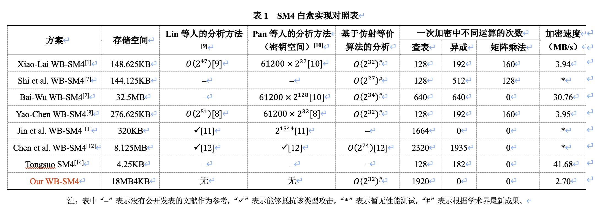

# 一个能抵抗侧信道攻击的SM4白盒实现

&emsp;&emsp;本文档主要介绍新设计的SM4白盒实现，包括设计原理、代码实现的详细流程、安全性分析以及与现有SM4白盒实现的比较。该SM4白盒实现在满足一定安全性（抵抗侧信道攻击）的前提下，具有较低的存储复杂度和较高的加密速度。

## 1 设计原理

&emsp;&emsp;根据前期调研，我们选择了非线性的字节置换编码来保护白盒实现内部查找表的输入和输出，并且在SM4的S盒变换和线性变换之后添加混淆矩阵以混淆SM4的线性变换，并使T表的输出更均匀。由于选择非线性置换，因此查找表输出的异或操作需要使用XOR表，单个XOR表输入16bit、输出8bit，需存储空间64KB，为节约白盒实现查找表的存储空间，我们采用XOR表的复用策略以降低存储。下面我们以加密函数为例解释设计原理（解密函数类似）。

### 1.1 T表与I型XOR表

&emsp;&emsp;SM4标准算法轮函数的核心步骤包括了32bit的非线性变换（4个并列的8bit S盒）以及32bit的循环移位变换。白盒实现的核心就是将这两个函数复合成查找表称为T表，如下图所示：

<div style={{ textAlign: 'center' }}>


图1 SM4白盒实现的T表示意图
</div>

&emsp;&emsp;其中，我们将32bit的线性移位变换L拆分成4部分，分别用32×8的矩阵表示。LB表示我们设置的混淆矩阵。在生成T表之前需要将128bit的用户密钥通过SM4的密钥扩展算法生成各轮所需的32bit轮密钥，因此T表是依赖密钥的，所以32轮轮函数需要128张T表，单一T表（8bit输入、32bit输出）需存储空间1KB，全部T表需128KB。图1中的d-NB和e-NB分别表示查找表的输入编码和输出编码（后文都这样表示），其中d-NB不重复利用。
&emsp;&emsp;由于我们将线性变换L表示成矩阵形式并进行了拆分，所以T表只实现了一部分矩阵运算，后续还需要进行异或运算，因此需要XOR表。XOR表的输入长度是2字节，输出是1字节，每个输入输出字节都需要编码，因此，XOR表之间是否相同是由这三个非线性编码决定的。一个XOR表的存储大小是一个T表的64倍，因此为了节约空间，我们需要考虑XOR表的重复利用。XOR表不包含关键信息（如密钥），而且其输入输出都有非线性编码保护（编码也难以被恢复），因此重复利用异或表并不会导致关键信息的泄露从而降低安全性。重复利用XOR表，在于编码的重复利用，例如T表的输出编码与其对应的XOR表的输入编码每轮都固定，那么每轮T表对应的XOR表就可以重复利用。图2展示了一类XOR表：

<div style={{ textAlign: 'center' }}>


图2 I型XOR表
</div>

&emsp;&emsp;I型XOR表由2层异或表构成，第一层的8个XOR表将4个T表的输出异或为2个32bit字，再经过第二层的4个XOR表得到1个32bit字，从而实现了SM4的L变换。观察图1和图2不难发现编码的颜色和标注都是对应的，对应位置的编码只需要生成一次即可，不需要每轮都生成新的编码，字母A、B、C等表示编码所在位置也表示编码的型号，例如B代表的编码位于T表的输出端和I型异或表第一层的输入，这对编码相互抵消来保证加密函数的功能性。既然可以重复利用编码，那为什么同一类型的编码不重复利用？比如B和C类型编码只生成一次，这样第一层XOR表只需要1个，还能再压缩空间。回答这个问题，需要考虑白盒实现的安全性，由于我们采用混淆矩阵是精心设计的，这样T表输出的每个字节都会与S盒对应且输出的每个字节都是均匀的（遍历输入会得到256种取值，对基于Walsh变换的谱分析[3]和DCA[4]等侧信道攻击有较高防御能力），若只采用一个编码，攻击者可以利用频率分析攻击每一轮的T表。而且XOR表的输入端的两个编码不能相同，若相同的话攻击者容易得到关于0的映射信息。在这种设计原则下，I型XOR表需存储空间为12×64KB=768KB。

### 1.2 混淆矩阵逆变换查找表与II型XOR查找表

&emsp;&emsp;我们在T表中添加了混淆矩阵LB，使T表的输出更均匀且提高了白盒实现抵御DCA和谱分析的能力。为了保证算法的标准性，我们需要将LB矩阵抵消掉。由于是矩阵运算，因此我们按照和构造T表一样的方式，将LB的逆矩阵进行拆分，并通过XOR表实现完整的矩阵乘法运算。如下图所示：

<div style={{ textAlign: 'center' }}>


图3 混淆矩阵逆变换查找表
</div>

&emsp;&emsp;在这里，我们需要强调，混淆矩阵是秘密生成的，每一轮的混淆矩阵可以相同也可以不同，这并不会对安全性产生影响，我们的方案选择固定的LB矩阵，因此32轮的查找表大小为4KB，若每轮选择新鲜的LB矩阵，那么查找表大小为128KB。图4是II型XOR表：

<div style={{ textAlign: 'center' }}>


图4 II型XOR表
</div>

&emsp;&emsp;II型XOR表的构造原则与I型相同，需要注意的是，无论是否重复利用混淆矩阵LB都不会影响II型XOR表的生成与存储，因为XOR表只与编码有关。I型XOR与II型XOR表在输出位置都保持了编码的新鲜性，使S盒对应位置的输出都是均匀的，保障了各个位置抵抗DCA和谱分析的能力。II型XOR表需存储空间12×64KB=768KB。

### 1.3 混淆矩阵的选择

&emsp;&emsp;混淆矩阵LB是32×32的矩阵，表示为：
<div style={{ textAlign: 'center' }}>

</div>

其中表示8×8的矩阵，为使S盒对应位置的输出都是均匀的，要求LB除了可逆还需满足三个条件:
（1）满足T表输出的均匀性：

T0：
<div style={{ textAlign: 'center' }}>

</div>
T1:
<div style={{ textAlign: 'center' }}>

</div>
T2:
<div style={{ textAlign: 'center' }}>

</div>
T3：
<div style={{ textAlign: 'center' }}>

</div>
需要保证上述16个方程对应的16个8×8的矩阵都是满秩的，其中H表示SM4线性变换矩阵L的分块矩阵；
（2）I型XOR表第一层输出的均匀性：
T0+T1：
<div style={{ textAlign: 'center' }}>

</div>
T2+T3：
<div style={{ textAlign: 'center' }}>

</div>
需要保证上述8个8*8的矩阵都是满秩的；
（3）I型XOR表第二层输出的均匀性：
T0+T1+T2+T3：
<div style={{ textAlign: 'center' }}>

</div>
需要保证上述4个8×8的矩阵都是满秩的。这样精心设计挑选的混淆矩阵能为T表提供抵御侧信道攻击更高的安全性。

### 1.4 轮函数的输入阶段和输出阶段

&emsp;&emsp;SM4算法每一轮都会生成一个新的32bit字，它是由当前轮的一个输入32bit字和SM4的F函数生成的32bit字异或得到的，如图5所示，因此轮函数的最后阶段也是由异或表实现的。需要注意的是，这类型异或表的输出编码必须保证每一轮的新鲜性，以抵御代数攻击。
<div style={{ textAlign: 'center' }}>


图5 SM4分组密码算法加密流程示意图
</div>

&emsp;&emsp;进入F函数的32bit字是由当前轮的3个输入32bit字异或得到的，因此也需要XOR表来实现。首先，我们先构造输入阶段的查找表，如图6所示：

<div style={{ textAlign: 'center' }}>


图6 输入查找表
</div>

&emsp;&emsp;其中，输入IN是根据前一轮的输出编码OUT生成的（除了前四轮中32bit字对应的输入编码是另外生成），因此，为了复用异或表，输入阶段应该再额外添加一层编码，即H编码，这样输入阶段的3个32bit字的异或就可以用8个异或表表示，其中第一层异或表可以进行复用，第二层异或表的输入编码可以复用，但是要保证输出编码A每轮新鲜，如图7所示：

<div style={{ textAlign: 'center' }}>


图7 III型XOR表
</div>

&emsp;&emsp;这样，输入查找表每轮都需要重新生成（IN新鲜，H型编码复用）共需存储空间32×4KB=128KB，III型异或表，共需存储空间4×64KB+4×64KB×32=8MB+256KB。最后还剩下轮函数的输出阶段，如图8所示：

<div style={{ textAlign: 'center' }}>


图8 输出XOR表
</div>

其中，由于H编码和G编码都可以复用，但是输出编码OUT必须保证每一轮新鲜，因此输出异或表不能复用，需存储空间32×4×64KB=8MB。
&emsp;&emsp;综上，全部SM4白盒实现的查找表共需存储空间为：T表（128KB）+I型异或表（768KB）+LB逆变换查找表（4KB）+II型异或表（768KB）+III型异或表（8MB256KB）+输入查找表（128KB）+输出异或表（8MB）共计18MB4KB。注意，这个存储空间是根据本文设计方案所需的最小空间，如果不进行表或者编码亦或混淆矩阵的重复利用，或者每隔几轮再重复利用，那么所需存储空间还会增多。

## 2 代码实现的详细流程

&emsp;&emsp;SM4白盒实现的代码包括查找表的生成和加密算法的实现两部分。代码由C语言编写，矩阵运算库为[WBMatrix](https://github.com/scnucrypto/WBMatrix)，代码主要参考了[Xiao-Lai白盒SM4实现[1]](https://github.com/Nexus-TYF/Xiao-Lai-White-box-SM4)和[Bai-Wu白盒SM4实现[2]](https://github.com/Nexus-TYF/Bai-Wu-White-box-SM4)和[SM4的实现](https://github.com/NEWPLAN/SMx/tree/master/SM4)。本文对应的代码实现链接为[WBSM4-ResistDCA](https://github.com/Tongsuo-Project/Tongsuo/pull/716)。

### 2.1 查找表的生成

&emsp;&emsp;构成查找表的元素包括8bit的非线性置换编码、混淆矩阵、轮密钥和S盒.\
（1）8bit非线性置换编码的生成与XOR表的构造\
&emsp;&emsp;采用随机置换的方式生成，但是需要加个约束条件：不能将0映射到0，限制敌手对于输出位置为0的判断。代码封装成函数：

```c
void Gen_BytePer(uint8_t *permutation, uint8_t *inverse)
```

&emsp;&emsp;由于各类查找表的输入输出都由非线性编码进行保护，因此在生成查找表前将所有非线性编码全部生成，需要注意输入查找表的IN编码和输出查找表的OUT编码与输入输出的32bit字的对应关系，并且同时生成对明文的进行编码和对密文进行解码的外部编码，对明文进行编码的外部编码作用于服务端，对密文进行解码的外部编码作用于客户端。由于XOR表只与输入和输出编码有关，因此在生成所有编码后就可以构造XOR表了，需要注意表与最终加密算法计算流程以及编码顺序的对应。

（2）轮密钥的生成\
&emsp;&emsp;参考[SM4的实现](https://github.com/NEWPLAN/SMx/tree/master/SM4)，封装成函数：

```c
void sm4_setkey_enc(sm4_context *ctx, unsigned char *key)
```

（3）混淆矩阵的生成\
&emsp;&emsp;根据1.3节的约束，对随机生成的32bit矩阵进行筛选，封装成函数：

```c
void Gen_LB（M32 *LB, M32 *LB_inv）
```

（4）构造T表和混淆矩阵逆变换查找表的构造\
&emsp;&emsp;根据图1和图3，按照顺序组合各种元素，需注意编码的选择，要与前序编码和后序编码对应。矩阵按照列来切割，需要注意主体32bit矩阵与分块8bit矩阵位置的对应关系。根据国家标准《GB/T 32907-2016》，SM4的解密函数与加密函数仅有的区别就是轮密钥的顺序，即解密函数的轮密钥是加密函数轮密钥的逆序，因此生成解密函数的T表只跟加密函数的T表的轮密钥顺序相反，其余各部分均相同。\
&emsp;&emsp;将所有生成查找表和外部编码的代码封装为函数：

```c
void wbsm4_gen(uint8_t *key,unsigned char *whitebox,size_t *whitebox_len)
```

其中参数key为传入的16字节原始密钥（用户密钥），指针参数whitebox是要返回的白盒查找表与外部编码的地址，whitebox_len是返回的白盒查找表与外部编码的大小，在调用wbsm4_gen函数时，函数会做指针参数whitebox是否为空的判断，若指向空指针则先返回whitebox_len，并不会进行生成白盒的操作，用户拿到白盒大小的参数whitebox_len后，可根据白盒大小进行内存分配，之后再调用wbsm4_gen函数才会生成白盒。

### 2.2 加/解密函数的实现

&emsp;&emsp;SM4分组密码的分组长度是128bit，共32轮，每轮生成一个32bit字并与当前轮输入的3个32bit字一起进入下一轮，因此加密轮函数的代码主要维护一个长度为16字节的队列。由于SM4的解密函数与加密函数仅有的区别就是轮密钥的顺序，即解密函数的轮密钥是加密函数轮密钥的逆序，对应到查找表中就只有T表的不同，因此我们选择将加解密操作封装成函数：

```c
void wbsm4_crypt(uint8_t input[16], uint8_t output[16] , unsigned char *whitebox, int mode)
```

参数whitebox指向的是由wbsm4_gen提前生成的白盒查找表，参数mode判断是加密操作还是解密操作。由于加密算法主要就是查表操作，因此在代码实现时需要注意查找表的顺序，还需注意SM4加密算法最后是逆序变换。最终加密函数

```c
void wbsm4_encrypt(uint8_t input[16], uint8_t output[16],unsigned char *whitebox)
```

和解密函数

```c
void wbsm4_decrypt(uint8_t input[16], uint8_t output[16],unsigned char *whitebox)
```

就是在调用wbsm4_crypt函数。

## 3 安全性分析

&emsp;&emsp;方案的安全性分析包括侧信道场景的安全性分析和白盒场景的安全性分析。

### 3.1侧信道分析

&emsp;&emsp;综合现有的侧信道安全性分析，如谱分析[3]ADCA[4]选择对T表进行攻击，我们可以将T表抽象成一个8->8的映射：
<div style={{ textAlign: 'center' }}>

</div>
其中NB表示单字节的非线性变换，NSM表示LB矩阵与SM4的L线性变换进行矩阵乘法得到的与一个S盒对应的矩阵，根据混淆矩阵LB的性质，我们可以证明NSM是非奇异矩阵（Non-Singular Matrix）。假设攻击者已知输入编码，那么根据文献[3]和[4]的方法与结论，在单字节输出编码和非奇异矩阵NSM的共同防护下，不能对该T表映射进行密钥区分攻击，因为NSM满秩不会对的代数度产生影响。我们进行了10000次的模拟实验，每次实验的外部编码均和NSM均按照白盒方案随机生成，密钥区分攻击均失败，因此该方案可以抵抗侧信道攻击。倘若攻击者并不知道输入编码，那么侧信道攻击则无法进行，因为无法通过明文猜测中间值。而选择仿射编码的白盒实现（如Xiao-Lai白盒SM4[1]、Bai-Wu白盒SM4[2]、Yao-Chen白盒SM4[8]等），无论编码是8bit、32bit还是64bit，其代数度都为1，因此在已知外部编码的情况下，容易受到侧信道攻击。

### 3.2 白盒攻击

&emsp;&emsp;对于一个白盒实现，攻击者想要对其进行攻击，首先需要对算法加密程序进行逆向分析得到源码或者白盒实现的全部查找表，这一步骤虽然繁琐，但我们假设攻击者能够完全获取白盒实现的全部信息，然后可以对查找表进行组合。我们将第i轮和第i+1轮的查找表进行组合，抽象出的攻击模型如图9所示：
<div style={{ textAlign: 'center' }}>


图9 攻击模型
</div>

其中，将置0，我们可以得到类似BGE攻击的模型[5]，通过这个模型我们能够利用BGE攻击的第一阶段的算法，将输入输出的单字节编码转换成8bit仿射编码，根据算法[6]，转换连续4轮单字节编码的时间复杂度约为O(2^18)，由于编码未知，因此BGE攻击不可行，但是我们构造了一个仿射等价问题[13]（S盒的输入输出端都是仿射编码），可以通过基于仿射等价算法[13]的攻击方法进行攻击。参考Xiao-Lai的SM4白盒实现，其攻击模型为：
<div style={{ textAlign: 'center' }}>


图10 Xiao-Lai白盒SM4攻击模型[1]
</div>

其中，红色框中的仿射变换最终可以得到一个32bit的常数，而输入编码和输出编码都是8bit的仿射变换。而我们所构造的白盒实现也可以转化成图10的形式，这样我们白盒实现的安全性至少可以规约到Xiao-Lai白盒SM4的安全性。最近，在CT-RSA 2025会议中录用的一篇文章是通过基于仿射等价的攻击方法对Xiao-Lai白盒SM4[1]、Bai-Wu白盒SM4[2]、Shi等人的白盒SM4[7]和Yao-Chen白盒SM4[8]进行了密钥恢复攻击，攻击复杂度分别是O(2^32),O(2^34),O(2^27),O(2^32)，时间复杂度比Lin-Lai攻击以及Pan等人的攻击都要低。截至目前文章还未公开，读者可以关注CT-RSA 2025会议（会议日期2025年4月28日至5月1日）了解详情。因此，根据学术界最新成果，攻击我们的白盒实现的时间复杂度也为O(2^32)（第一步将单字节编码转换成仿射编码的时间复杂度与相比可忽略）。

## 4 与现有SM4白盒实现的比较

<div style={{ textAlign: 'center' }}>

</div>

&emsp;&emsp;表1中罗列的白盒实现都是具有外部编码的，存储空间仅为加密函数（或解密函数）所需空间，并不包括服务端对原始数据编码的存储大小以及客户端对加密（解密）得到的密文（明文）进行解码的大小。另外，表1虽然列出Lin等人和Pan等人的分析方法，但是Lin的攻击方法存在偏差，而Pan等人的分析方法只能确定密钥搜索空间而不能进行密钥恢复，因此只有基于仿射等价算法的攻击能够真实反应白盒实现的安全性。加密算法测试平台的配置：CPU：Apple M2；内存：16GB；系统：Sequoia 15.3.1。测试代码未经过优化，加密速度仅供参考。

## 5 API说明与调用实例

面向用户的API：\
1）白盒生成函数

```c
void wbsm4_gen(uint8_t *key,unsigned char *whitebox,size_t* whitebox_len)
```

其中参数key为传入的16字节原始密钥（用户密钥），指针参数whitebox是要返回的白盒查找表与外部编码的地址，whitebox_len是返回的白盒查找表与外部编码的大小，在调用wbsm4_gen函数时，函数会做指针参数whitebox是否为空的判断，若指向空指针则先返回whitebox_len，并不会进行生成白盒的操作，用户拿到白盒大小的参数whitebox_len后，可根据白盒大小进行内存分配，之后再调用wbsm4_gen函数才会生成白盒。\
2）加密函数

```c
void wbsm4_encrypt(uint8_t input[16], uint8_t output[16],unsigned char *whitebox)
```

和解密函数

```c
void wbsm4_decrypt(uint8_t input[16], uint8_t output[16],unsigned char *whitebox)
```

传入的参数input为明文/密文，加密/解密得到的结果传入output，whitebox是由wbsm4_gen函数生成的白盒查找表。\
调用API测试实例与代码：\

```c
/*用户密钥*/
static const uint8_t k[16] = {
    0x01, 0x23, 0x45, 0x67, 0x89, 0xab, 0xcd, 0xef,
    0xfe, 0xdc, 0xba, 0x98, 0x76, 0x54, 0x32, 0x10
};

static const uint8_t input[16] = {
    0x01, 0x23, 0x45, 0x67, 0x89, 0xab, 0xcd, 0xef,
    0xfe, 0xdc, 0xba, 0x98, 0x76, 0x54, 0x32, 0x10
};

static const uint8_t expected[16] = {
    0x68, 0x1e, 0xdf, 0x34, 0xd2, 0x06, 0x96, 0x5e,
    0x86, 0xb3, 0xe9, 0x4f, 0x53, 0x6e, 0x42, 0x46
};

uint8_t block[16];
uint8_t key[16];
unsigned char *wb = NULL;
size_t whitebox_len = 0;

memcpy(key, k, 16);
memcpy(block, input, 16);

/*生成白盒*/
wbsm4_gen(key,wb,&whitebox_len);
wb = malloc(whitebox_len);
wbsm4_gen(key,wb,&whitebox_len);

/*加密*/
wbsm4_encrypt(block, block, wb);
/*解密*/
wbsm4_decrypt(block, block, wb);

free(wb);
```

加密实例:

|名称|内容(16进制)|
| :------------: | :-------------: |
| 明文: | 01 23 45 67 89 ab cd ef fe dc ba 98 76 54 32 10 |
| 用户密钥: | 01 23 45 67 89 ab cd ef fe dc ba 98 76 54 32 10 |
| 密文: | 68 1e df 34 d2 06 96 5e 86 b3 e9 4f 53 6e 42 46 |

解密实例:

|名称|内容(16进制)|
| :------------: | :-------------: |
| 密文: | 68 1e df 34 d2 06 96 5e 86 b3 e9 4f 53 6e 42 46 |
| 用户密钥: | 01 23 45 67 89 ab cd ef fe dc ba 98 76 54 32 10 |
| 明文: | 01 23 45 67 89 ab cd ef fe dc ba 98 76 54 32 10 |

## 参考文献

[1] 肖雅莹, 来学嘉. 白盒密码及SMS4算法的白盒实现[C]. 中国密码学会2009年会. 北京: 科学出版社, 2009: 24–34.\
[2] Bai K, Wu C. A secure white‐box SM4 implementation[J]. Security and Communication Networks, 2016, 9(10): 996-1006.\
[3] Carlet C, Guilley S, Mesnager S. Structural attack (and repair) of diffused-input-blocked-output white-box cryptography[J]. IACR Transactions on Cryptographic Hardware and Embedded Systems, 2021, 2021(4): 57-87.\
[4] Tang Y, Gong Z, Li B, et al. Revisiting the computation analysis against internal encodings in white-box implementations[J]. IACR Transactions on Cryptographic Hardware and Embedded Systems, 2023, 2023(4): 493-522.\
[5] Billet O, Gilbert H, Ech-Chatbi C. Cryptanalysis of a white box AES implementation[C]//Selected Areas in Cryptography: 11th International Workshop, Revised Selected Papers. Springer, 2005: 227-240.\
[6] Tolhuizen L. Improved cryptanalysis of an AES implementation[C]//Proceedings of the 33rd WIC Symposium on Information Theory in the Benelux. 2012: 68-71.\
[7] Shi Y, He Z. A lightweight white-box symmetric encryption algorithm against node capture for WSNs[C]//Proceedings of 2014 IEEE Wireless Communications and Networking Conference. IEEE, 2014: 3058-3063.\
[8] 姚思, 陈杰. SM4算法的一种新型白盒实现[J]. 密码学报, 2020, 7(3): 358-374.\
[9] 林婷婷, 来学嘉. 对白盒SMS4实现的一种有效攻击[J]. 软件学报, 2013, 24(9): 2238-2249.\
[10] 潘文伦, 秦体红, 贾音, 等. 对两个SM4白盒方案的分析[J]. 密码学报, 2018, 5(6): 651-671.\
[11] Jin C, Bao Z, Miao W, et al. A lightweight nonlinear white-box SM4 implementation applied to edge LoT agents[J]. IEEE Access, 2023, 11: 68717 - 68727.\
[12] Chen J, Luo Y, Liu J, et al. A white-box implementation of SM4 with self-equivalence encoding[J]. The Computer Journal, 2024, 67(3): 1087-1098.\
[13] Biryukov A, De Canniere C, Braeken A, et al. A toolbox for cryptanalysis: Linear and affine equivalence algorithms[C]//Advances in Cryptology - EUROCRYPT 2003: International Conference on the Theory and Applications of Cryptographic Techniques, Proceedings. Springer, 2003: 33-50.\
[14]Tongsuo. [EB/OL]. [2025-03-20]. https://github.com/Tongsuo-Project/Tongsuo.
