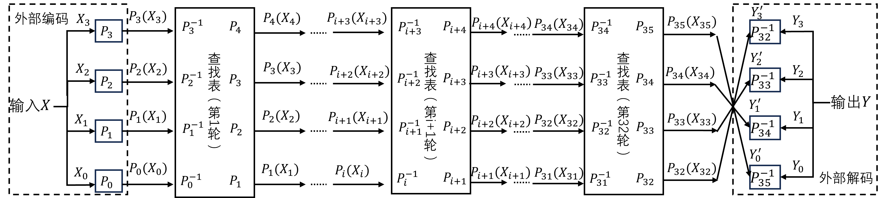

# 一种基于非线性双射的SM4白盒实现

本文档主要介绍基于非线性双射的SM4白盒实现方案，包括设计原理、代码实现的详细流程、安全性分析、与现有SM4白盒实现的比较以及白盒API调用示例。

## 1 设计原理

本方案采用了非线性双射置乱编码技术，用于对SM4算法中的查找表进行有效地混淆和保护。与传统的线性仿射变换[1]相比，非线性双射的设计显著提高了查找表的安全性，这种设计避免了在白盒实现中常见的、攻击者可能利用的数学特征，从而使得查找表能够成功抵御那些专门针对白盒实现的攻击。此外，本方案还对SM4算法的每一轮加解密计算过程进行了细致的拆分，将其分为个若干独立的部分，这一拆分过程遵循了如图1-1所示的构造方法，通过精心设计的置乱编码生成查找表，每一部分都应用了经过特别设计的置乱编码技术，以实现对查找表的混淆。这种混淆机制有效地隐藏了密钥信息，从而在白盒攻击环境下确保了SM4算法的加解密过程的安全性。


图1-1 非线性双射白盒SM4方案架构图

方案具体实现如图1-1所示。其中，$ P_i，E_i，F_i，Q_i，W_i，C_i，D_i $表示四个并行的8位随机非线性双射，$ G_i，H_i，A_i，B_i $表示四个并行的8位随机仿射变换，而$ A_i $和$ B_i $除了所对应的常数项$ C $中所有元素的值均被置为0之外，变换$ A_i $和$ G_i $完全一致，变换$ B_i $和$ H_i $完全一致。这里所提到的仿射变换可以与有限域$ GF(2) $上的矩阵运算等效，上述四个变换的设计原理在于，对于仿射变换$ F(X)=M×X^T+C $，其变换结果在互相进行按位异或操作后，常数部分$ C $会被抵消，即在$ GF(2) $中满足式（1）：
$$
F(X)⊕F(Y)=(M×X^T+C)⊕(M×Y^T+C)=M×(X⊕Y)^T\tag{1}
$$
在图1-1中，函数$ S_{ij} $如式（2）所示，其中$ i=0,1,...,31 $表示加密轮次。$ rk_{ij} $是轮密钥$ rk_i $的组成部分，$ j=0,1,2,3 $，如式（3）所示：
$$
S_{ij} (x_j )=Sbox(x_j⊕rk_{ij} )\tag{2}
$$

$$
rk_i=[rk_{i0},rk_{i1},rk_{i2},rk_{i3}]\tag{3}
$$

线性变换$ L $可以表示为与一个$ GF(2) $上的32×32位的矩阵$ L $相乘，该矩阵的定义如式（4）所示，其组成元素$ B_1，B_2，B_3 $是由1和0组成的矩阵。
$$
L = 
\begin{bmatrix}
B_1 & B_2 & B_2 & B_3 \\
B_3 & B_1 & B_2 & B_2 \\
B_2 & B_3 & B_1 & B_2 \\
B_2 & B_2 & B_3 & B_1
\end{bmatrix}\tag{4}
$$
基于每一轮SM4算法的计算过程，图1-1中每一部分所实现的功能如下：Part 1和Part 4-1实现$ X_{i+1}，X_{i+2}，X_{i+3} $三者的按位异或运算；Part 2和Part 4-2实现该计算结果与轮密钥的按位异或运算，再将结果进行$ T $变换操作；最后，Part 3和Part 4-3实现上述$ T $变换的结果与$ X_i $的按位异或计算。

在本方案中，我们将前述的运算过程以查找表的形式进行表示，并将这些查找表存储于本地设备上，需要特别指出的是，此处仅保存了每一部分运算中经过一系列变换复合后得到的最终变换所对应的查找表。如果为每个单独的变换都创建并存储其对应的查找表，那么置乱编码的关键信息将有可能被直接暴露，从而无法确保白盒实现方法的安全性。为了确保查找表能够准确反映每一部分的输入与输出之间的关系，对于每个可能的输入值，都必须存储其相应的输出值，因此，为了防止查找表的体积过大，我们不能为输入数据分配过多的位数。同时，为了确保查找表具有足够的混淆效果，输入数据的位数也不能设置得过少，在SM4算法中，每一轮的输入数据被划分为4个区块，每个区块包含32位，经过编码处理后，每个区块的长度仍然保持为32位。考虑到避免查找表占用过多内存，本实现方案将每一部分的输入数据以8位为单位进行细分。因此，上文中提到的混淆操作全部是基于四个并行的8位变换来实现的。对于Part 1、Part 2和Part 3，每张查找表的输入数据长度为8位，这意味着需要存储$ 2^{16}$条数据。而对于Part 4-1、Part 4-2和Part 4-3，由于需要实现包含编码和解码操作的按位异或功能，每张查找表的输入数据长度为16位，因此需要存储$ 2^{16}$条数据。通过这种设计，我们能够在保证查找表具有足够混淆效果的同时，有效控制查找表的体积，从而在白盒环境下实现SM4算法的安全运算。

显然，Part 4-1、 Part 4-2 和 Part 4-3 中的查找表占据了大部分的存储空间。因此本方案对有关查找表的编码与解码函数进行设计，使得 Part 4-1与 Part 4-2的查找表能够重复利用，从而降低了对存储空间的需求。如图1-1所示，对 Part 4-1和Part 4-2，其中一个输入的解码函数，即$ E_i $和$ Q_i^{-1} $，与输出的编码函数，即$E_i^{-1} $和$ Q_i $相匹配。为了进一步提升查找表的多样性和含混度，在输出编码时分别引入仿射变换$ G_i $和$ H_i $，可以在不影响查找表功能，同时不增加内存占用的前提下，有效提升其安全性。由于仿射变换的引入，其他部分的查找表也需要增加相应的混淆函数，具体的添加方式如图1-1所示。通过以上的设计，部分查找表可实现复用，进而使得所需要的总存储空间减少了大约一半。大部分设备的内存空间足够用来存储本实现方法，可以保证本方案在大多数情况下的实用性。

## 2 代码实现的详细流程

基于非线性双射的白盒SM4实现代码包括查找表生成与加密算法实现两部分，加解密流程如图2-1所示。代码主要参考了[Xiao-Lai白盒SM4实现[2]](https://github.com/Nexus-TYF/Xiao-Lai-White-box-SM4)和[Bai-Wu白盒SM4实现[3]](https://github.com/Nexus-TYF/Bai-Wu-White-box-SM4)和 [Xiao-Lai白盒AES实现[4]](https://github.com/Nexus-TYF/Xiao-Lai-White-box-AES)。本文对应的代码实现链接为[nonlinearwbsm4](https://github.com/Tongsuo-Project/Tongsuo/pull/708)。



图2-1 非线性双射白盒SM4加解密流程

### 2.1 查找表生成

**1）初始化**

- 定义 SM4 算法相关常量，如 S 盒、轮密钥生成所需的 FK 和 CK 常量。
- 声明一系列非线性和仿射变换的变量，用于后续表的生成。
- 调用 `wbsm4_gen_init` 函数，生成 36 轮的 `Pij` 和 `Pij_inv` 非线性双射对，并将其组合成 32 位的 `Pi` 和 `Pi_inv`。同时，生成 32 轮的 `Ei`、`Fi`、`Gi`、`Ai`、`Qi`、`Hi`、`Bi`、`Wi`、`Ci`、`Di` 及其逆变换，每个 32 位变换由 4 个 8 位变换组成。

**2）** **各部分查找表生成**

- `wbsm4_gen_part1`：生成 32 轮的查找表 `part1_table1`、`part1_table2` 和 `part1_table3`，每轮有 4 个输入 8 位、输出 8 位的查找表。通过对 `Pij_inv` 与 `Eij_inv`、`Fij_inv`、`Gij` 进行复合运算得到。
- `wbsm4_gen_part2`：依赖于 SM4 轮密钥 `sm4_key`，生成查找表 `part2_table_temp` 和 `part2_table`。`part2_table_temp` 通过对 `Eij`、`Gij_inv`、`Aij_inv` 进行复合运算，并与轮密钥异或后查 S 盒得到；`part2_table` 则是对不同移位的输入进行 `Qi`、`Wi`、`Hi` 变换得到。
- `wbsm4_gen_part3`：生成查找表 `part3_table1`、`part3_table1_dec` 和 `part3_table2`。`part3_table1` 和 `part3_table1_dec` 通过对 `Pij_inv` 与 `Cij` 进行复合运算得到；`part3_table2` 通过对 `Qij_inv`、`Hij_inv`、`Bij_inv` 进行复合运算，并经过 `Dij` 变换得到。
- `wbsm4_gen_part4_1`：生成 32 轮的查找表 `part4_1_table`，每轮有 4 个输入 16 位、输出 8 位的查找表。通过对 `Eij` 和 `Fij` 进行异或，再经过 `Gij` 和 `Eij_inv` 变换得到。
- `wbsm4_gen_part4_2`：生成 32 轮的查找表 `part4_2_table`，每轮有 4 个输入 16 位、输出 8 位的查找表。通过对 `Qij_inv` 和 `Wij_inv` 进行异或，再经过 `Hi` 和 `Qi` 变换得到。
- `wbsm4_gen_part4_3`：生成 32 轮的查找表 `part4_3_table` 和 `part4_3_table_dec`，每轮有 4 个输入 16 位、输出 8 位的查找表。通过对 `Cij_inv` 和 `Dij_inv` 进行异或，再经过 `Pij` 变换得到。

查找表生成的函数接口如下：

```c
void Nonlinearwbsm4_generate_tables(const uint8_t key[16], WB_SM4_Tables* tables);
```

### 2.2 加密函数的实现

**1）输入外部编码**

- 把 16 字节的输入数据 `IN` 拆分成 4 个 32 位的整数 `x0`、`x1`、`x2`、`x3`。
- 分别对 `x0`、`x1`、`x2`、`x3` 运用 `tables->P[0]`、`tables->P[1]`、`tables->P[2]`、`tables->P[3]` 进行非线性变换。

**2）执行核心加密**

进行 32 轮迭代，每轮迭代包含以下步骤：

- part1：借助查找表 `part1_table1`、`part1_table2`、`part1_table3` 对 `x1`、`x2`、`x3` 进行变换，得到 `xt1`、`xt2`、`xt3`。
- part4-1：把 `xt1`、`xt2`、`xt3` 按 8 位分割，利用查找表 `part4_1_table` 进行变换，得出 `x4`。
- part2：将 `x4` 按 8 位分割，使用查找表 `part2_table_temp` 进行变换，再通过矩阵乘法 `MatMulNumM32` 对结果进行处理，接着利用查找表 `part2_table` 进一步变换，得到中间结果。
- part4-2：把中间结果按 8 位分割，利用查找表 `part4_2_table` 进行变换，更新 `x4`。
- part3：借助查找表 `part3_table1`、`part3_table2` 对 `x0`、`x4` 进行变换，得到 `xt0`、`xt4`。
- part4-3：把 `xt0`、`xt4` 按 8 位分割，利用查找表 `part4_3_table` 进行变换，更新 `x4`。
- 更新 `x0`、`x1`、`x2`、`x3` 的值，即 `x0 = x1; x1 = x2; x2 = x3; x3 = x4;`。

**3）输出外部解码**

- 分别对 `x3`、`x2`、`x1`、`x0` 运用 `tables->P_inv[35]`、`tables->P_inv[34]`、`tables->P_inv[33]`、`tables->P_inv[32]` 进行非线性逆变换，得到 `out0`、`out1`、`out2`、`out3`。
- 把 `out0`、`out1`、`out2`、`out3` 组合成 16 字节的输出数据 `OUT`。

```c
void Nonlinearwbsm4_encrypt(const unsigned char IN[16], unsigned char OUT[16], const WB_SM4_Tables* tables);
```

### 2.3 解密函数的实现

**1）输入外部编码**

- 把 16 字节的输入数据 `IN` 拆分成 4 个 32 位的整数 `x0`、`x1`、`x2`、`x3`。
- 分别对 `x0`、`x1`、`x2`、`x3` 运用 `tables->P[35]`、`tables->P[34]`、`tables->P[33]`、`tables->P[32]` 进行非线性变换。

**2）执行核心解密**

进行 32 轮迭代，不过迭代顺序是从第 31 轮倒着到第 0 轮，每轮迭代包含以下步骤：

- part1：借助查找表 `part1_table3`、`part1_table2`、`part1_table1` 对 `x1`、`x2`、`x3` 进行变换，得到 `xt1`、`xt2`、`xt3`。
- part4-1：把 `xt1`、`xt2`、`xt3` 按 8 位分割，利用查找表 `part4_1_table` 进行变换，得出 `x4`。
- part2：将 `x4` 按 8 位分割，使用查找表 `part2_table_temp` 进行变换，再通过矩阵乘法 `MatMulNumM32` 对结果进行处理，接着利用查找表 `part2_table` 进一步变换，得到中间结果。
- part4-2：把中间结果按 8 位分割，利用查找表 `part4_2_table` 进行变换，更新 `x4`。
- part3：借助查找表 `part3_table1_dec`、`part3_table2` 对 `x0`、`x4` 进行变换，得到 `xt0`、`xt4`。
- part4-3：把 `xt0`、`xt4` 按 8 位分割，利用查找表 `part4_3_table_dec` 进行变换，更新 `x4`。
- 更新 `x0`、`x1`、`x2`、`x3` 的值，即 `x0 = x1; x1 = x2; x2 = x3; x3 = x4;`。

**3）输出外部解码**

- 分别对 `x3`、`x2`、`x1`、`x0` 运用 `tables->P_inv[0]`、`tables->P_inv[1]`、`tables->P_inv[2]`、`tables->P_inv[3]` 进行非线性逆变换，得到 `out0`、`out1`、`out2`、`out3`。
- 把 `out0`、`out1`、`out2`、`out3` 组合成 16 字节的输出数据 `OUT`。

白盒解密函数接口如下：

```c
void Nonlinearwbsm4_decrypt(const unsigned char IN[16], unsigned char OUT[16], const WB_SM4_Tables* tables);
```

## 3 安全性分析

### 3.1 白盒多样性和白盒含混度

为了更好地计算所提出白盒 SM4 实现方法的多样性和含混度[5]，需要对所使用的置乱编码的可选择数量进行计算，主要是仿射变换和非线性双射。在此基础上，根据实现方法的结构和生成方式进行具体计算。对于一个$ GF(2) $上的随机的$ t $位可逆仿射变换，所有可能的选择的数量为：
$$
h(t)=2^t\times\prod_{i = 0}^{t - 1}(2^t - 2^i)\tag{5}
$$
同时，对于一个随机的 8 位非线性双射，输入输出都随机一一对应，因此所有可能的选择的数量为 256!。对于非线性白盒 SM4 实现，每一轮所使用的轮密钥的长度为 32 位，因此每一轮的密钥空间为$ 2^{32} $。根据上文分析，可以计算得到非线性白盒 SM4 实现每一轮各个部分的多样性与含混度如表3-1所示。相较于仿射变换，同样的输入输出位数下非线性双射的可选择数量显著增加了，这极大地提升了实现方法的多样性和含混度，增强了抗暴力攻击的能力，使其安全性有了明显提升。总的来说，从多样性与含混度的计算结果来看，攻击者几乎不可能通过对矩阵和查找表的穷举攻击来获取密钥和置乱编码信息。也就是说，本文所提出的白盒 SM4实现方法可以有效抵抗暴力攻击。更进一步，将该方案的多样性和含混度与已有的方案进行对比。

表3-1 非线性白盒SM4实现的多样性与含混度

| 阶段     | 多样性                                                       | 含混度                            |
| -------- | ------------------------------------------------------------ | --------------------------------- |
| Part 1   | $ (256!)^8×(256!)^8×(256!)^4×h(8)^4≈2^{33960} $              | $ (256!)^8×h(8)^4≈2^{13752} $     |
| Part 2   | $ (256!)^4×h(8)^4×2^{32}×(256!)^4×(256!)^4×h(8)^4≈2^{20800} $ | $ (256!)^4×h(8)^4×2^32≈2^{7048} $ |
| Part 3   | $ (256!)^8×(256!)^8×h(8)^4≈2^{27224} $                       | $ (256!)^8×h(8)^4≈2^{13752} $     |
| Part 4-1 | $ (256!)^8×h(8)^4≈2^{13752} $                                | $ h(8)^4≈2^{280} $                |
| Part 4-2 | $ (256!)^8×h(8)^4≈2^{13752} $                                | $ h(8)^4≈2^{280} $                |
| Part 4-3 | $ (256!)^{12}≈2^{20208} $                                    | $ h(8)^4≈2^{280} $                |

由于不同实现方案的结构不尽相同，因此很难将他们的多样性与含混度进行统一的比较。考虑到肖-来白盒SM4方案[6]与本论文所提出的两个方案在结构上最为相似，这里将肖-来白盒SM4方案的多样性与含混度列出在表3-2中，以方便比较。通过对比，可以看出相较于肖-来方案，本方案的多样性与含混度均有显著提升，且提升幅度远大于内存占用和加解密所需时间的增长幅度。

表3-2 肖-来方案的多样性与含混度

| 阶段   | 多样性                           | 含混度                    |
| ------ | -------------------------------- | ------------------------- |
| Part 1 | $ h(32)^3×h(8)^4=2^{3442} $      | $ h(8)^4≈2^{280} $        |
| Part 2 | $ h(8)^4×2^{32}×h(32)=2^{1366} $ | $ 2^{32} $                |
| Part 3 | $ h(32)^3×2^{32}=2^{3194} $      | $ h(32)×2^{32}=2^{1086} $ |

### 3.2 抗BGE型攻击

BGE攻击是由Billet、Gilbert和Ech-Chatbi[7]三位研究学者提出的一种攻击方法，最开始提出的目的是攻击Chow等人[5]的白盒AES方案，其主要攻击思路是通过合并相邻轮次的查找表并取消输入输出置乱编码的逆变换，从而暴露出内部的密钥信息。Chow的白盒实现中，输入置乱和输出置乱的逆变换可以相互抵消，导致攻击者可以通过查找表的合并简化运算，最终恢复出密钥。因此，BGE攻击的核心是通过对轮次间的置乱逆变换进行消除，削弱其保护效果。经过分析，BGE 攻击能有效地攻击Chow的算法并观察到密钥信息。

非线性白盒SM4通过引入随机的非线性双射置乱编码来增强算法的安全性。与传统的线性置乱编码不同，非线性双射的设计使得相邻查找表的运算不能简单地合并，置乱编码的逆变换不会像线性编码那样被直接抵消。具体来说，非线性白盒SM4中的置乱编码引入了非线性变换，这些变换增加了攻击者在逆向查找表时的复杂度，即便攻击者通过BGE攻击合并了查找表，非线性编码的存在也使得攻击者无法轻易解析和消除查找表中的置乱信息。非线性白盒SM4通过以下几点有效抵御BGE攻击。

1）非线性双射置乱编码：相比于传统的线性置乱，非线性置乱具有更复杂的数学结构，使得攻击者难以构建有效的代数方程来简化查找表。非线性编码使得置乱逆变换无法被简单消除，从根本上防止了BGE攻击的查找表合并策略，四个并行的 8 位随机非线性双射可以用如式（6）表示。
$$
P_i (x_0,x_1,x_2,x_3)=[P_{i0} (x_0),P_{i1}(x_1),P_{i2}(x_2),P_{i3}(x_3)]\tag{6}
$$
其中函数$ P_{ij}(•) $的输入输出关系是完全随机的，该变换为双射，输入输出一一对应。

2）引入随机常量的混淆操作：非线性白盒SM4在轮函数的输入置乱中引入了随机常量，这使得即使攻击者试图通过查找表合并来消除置乱的影响，这些随机常量也会干扰他们的攻击过程，使其难以恢复出密钥。

3）复杂的仿射变换与置乱设计：在算法的设计中，仿射变换与非线性置乱相结合，使得攻击者难以通过BGE攻击简化输入输出的映射关系。这种复杂的组合大幅增加了逆向求解密钥的难度。

### 3.3 抗仿射等价算法攻击

对于基于非线性的高安全白盒SM4实现，仿射等价算法攻击[8]主要依赖于将加密算法简化为仿射变换模型，从而识别出某些对应关系，进而破坏密钥保护的效果。传统白盒加密方案中，由于查找表和逻辑结构的简单性，攻击者可以通过计算密钥之间的线性关系或利用仿射变换特性来逆推出密钥。基于非线性的高安全白盒SM4实现通过引入随机的非线性混淆技术，使查找表不再是简单的仿射关系，而是变为具有非线性结构的复杂映射。非线性双射的加入使得加密逻辑和查找表之间的关系更加复杂化，难以通过仿射变换来简化和推导。通过这种方法，攻击者在试图利用仿射等价性进行攻击时将遭遇无法处理的高度复杂的非线性映射，从而有效抵抗此类攻击。

从数学角度来看，仿射等价算法攻击主要试图通过构建一个线性或仿射方程组，来推导出查找表或算法中的关键关系。而在本作品的实现方案中：非线性混淆函数的引入使得加密过程本质上不再是线性可分的，这意味着攻击者无法通过线性方程组来表征加密过程的内部关系。多层次仿射变换的随机化应用使每一轮的加密过程都具有动态的、非固定的性质，使得攻击者即便能够构建方程组，这些方程也因非线性的引入而变得难以求解。因此，通过增加非线性因素和动态仿射变换，该方案实现了对仿射等价算法攻击的有效抵抗。

## 4 内存占比与加解密速度

### 4.1 内存占比

基于非线性双射的白盒SM4实现方法，每一轮中Part 1、Part 2和3分别包含12、16和8张查找表，其中每张查找表包含$ 2^8 $个8位数据，而Part 4-1、Part 4-2和Part 4-3共包含12张查找表，每张查找表包含$ 2^{16} $个8位数据，因此32轮的白盒实现内存占用共为：$ ((12+16+8)×2^8×8bit+12×2^{16}×8bit)×32=24.28MB $。

不同于已有的白盒实现方案，本实现方案采用非线性双射作为置乱编码以提升安全性，因此需要引入 Part 4-1、4-2 和 4-3 辅助计算，导致内存占用不可避免地大幅度增加。不同白盒 SM4 实现方案之间内存占用的比较如表3-3所示。基于非线性双射的白盒 SM4 实现方法适用于大部分设备，尤其是那些可以容忍较高内存占用以换取更高安全保障的设备，尽管牺牲了一定的空间效率，这种方案依然在提升安全性方面发挥了关键作用。

表3-3 几种白盒算法内存占用比较

| 加密算法                 | 占用空间   | 查表或异或次数 | 仿射变换次数 |
| ------------------------ | ---------- | -------------- | ------------ |
| SM4-128                  | 544 B      | 256            | 64           |
| AES-128                  | 4352 B     | 300            | 0            |
| Chow-白盒AES[5]          | 752 KB     | 3104           | 0            |
| 肖-来白盒SM4[6]          | 148.625 KB | 128            | 160          |
| 尚-白盒SM4[9]            | 16.012MB   | 64             | 160          |
| WBDL算法[10]             | 466.914 KB | 128            | 160          |
| 基于非线性双射的白盒 SM4 | 24.28MB    | 1216           | 0            |

### 4.2 加解密速度

测试环境：Intel Core i7处理器、 8GB 内存、 64 位 Windows 10 操作系统，软件为 Microsoft Visual Studio 2019，加密速度平均约为7.33 Mbits/s，解密速度平均约为7.20 Mbits/s。测试代码未经过优化，加解密速度仅供参考。

| 加密算法                | 处理器        | 内存（GB） | 操作系统   | 加密速率        |
| ----------------------- | ------------- | ---------- | ---------- | --------------- |
| SM4 算法                | Intel Core i7 | 8          | Windows 10 | 40.299 Mbits/s  |
| 肖-来白盒SM4[6]         | Intel Core i7 | 8          | Windows 10 | 122.638 Kbits/s |
| 尚-白盒SM4[9]           | Intel Core i7 | 8          | Windows 10 | 3.5 Kbits/s     |
| WBDL算法[10]            | Intel Core i7 | 8          | Windows 10 | 273Kbits/s      |
| 基于非线性双射的白盒SM4 | Intel Core i7 | 8          | Windows 10 | 7.33 Mbits/s    |

## 5 白盒API调用示例

### 5.1 API说明

```c
//白盒查找表生成
void Nonlinearwbsm4_generate_tables(const uint8_t key[16], WB_SM4_Tables* tables);
// 白盒加密核心接口
void Nonlinearwbsm4_encrypt(const unsigned char IN[16], unsigned char OUT[16], const WB_SM4_Tables* tables);
// 白盒加密核心接口
void Nonlinearwbsm4_decrypt(const unsigned char IN[16], unsigned char OUT[16], const WB_SM4_Tables* tables);
```

### 5.2 调用示例代码

```c
#include "nonlinearwbsm4.h"
#include <string.h>
#include <time.h>
int main() {
    unsigned char key[16] = { 0x78, 0x3b, 0xd7, 0x63, 0x47, 0xaa, 0x6b, 0xfe, 0x47, 0x05, 0xeb, 0xc0, 0x60, 0x4a, 0x7b, 0x0f };
    unsigned char IN[16] = { 0x00, 0x11, 0x22, 0x33, 0x44, 0x55, 0x66, 0x77, 0x88, 0x99, 0xaa, 0xbb, 0xcc, 0xdd, 0xee, 0xff };
    unsigned char OUT[16], DEC_OUT[16];
    // ==== 白盒加密测试 ====
    WB_SM4_Tables* tables = malloc(sizeof(WB_SM4_Tables)); 
    memset(tables, 0, sizeof(WB_SM4_Tables)); 
    //WB_SM4_Tables tables;
    Nonlinearwbsm4_generate_tables(key, tables);
    Nonlinearwbsm4_encrypt(IN, OUT, tables);
    printf("[白盒加密结果]: ");
    printstate(OUT);
    // 白盒解密测试
    Nonlinearwbsm4_decrypt(OUT, DEC_OUT, tables);
    printf("[白盒解密结果]: ");
    printstate(DEC_OUT);
    Nonlinearwbsm4_free_tables(tables);
    free(tables); 

//    // ==== 标准SM4解密对比 ====
//    unsigned char STD_OUT[16];
//    sm4_context ctx_std;
//    sm4_setkey_enc(&ctx_std, key);
//    sm4_crypt_ecb(&ctx_std, 0, 16, IN, STD_OUT);
//    printf("[标准加密结果]: ");
//    printstate(STD_OUT);
//    // ==== 标准SM4解密对比 ====
//    unsigned char STD_DEC_OUT[16];
//    sm4_context ctx_std_dec;
//    sm4_setkey_dec(&ctx_std_dec, key);
//    sm4_crypt_ecb(&ctx_std_dec, 0, 16, STD_OUT, STD_DEC_OUT);
//    printf("[标准解密结果]: ");
//    printstate(STD_DEC_OUT);
    return 0;
}
```

## 参考文献

> [1]肖雅莹, 来学嘉. 白盒密码及SMS4算法的白盒实现[C]. 中国密码学会2009年会. 北京: 科学出版社, 2009: 24–34.
>
> [2]https://github.com/Nexus-TYF/Xiao-Lai-White-box-SM4
>
> [3]https://github.com/Nexus-TYF/Bai-Wu-White-box-SM4
>
> [4]https://github.com/Nexus-TYF/Xiao-Lai-White-box-AES
>
> [5]Chow, S. and Eisen, P. and Johnson, H. and Van Oorschot, P.C.. White-Box Cryptography and an AES Implementation[J]. Lecture Notes in Computer Science, 2003, 2595: 250-270. 
>
> [6]肖雅莹. 白盒密码及 AES 与 SMS4 算法的实现[M].上海交通大学. 2010. 
>
> [7]Billet O, Gilbert H, Ech-Chatbi C. Cryptanalysis of a white box AES implementation[J]. Selected Areas in Cryptography, 2005, 3357: 227-240.
>
> [8]姚思, 陈杰. SM4算法的一种新型白盒实现[J]. 密码学报, 2020, 7(3): 358-374.
>
> [9]尚培. SMS4 算法的白盒密码算法设计与实现 [D]. 成都: 电子科技大学, 2016. 
>
> [10]YANG Y T, DONG H, ZHANG Y, ZHANG Y S. WBDL: Improved SM4 dynamic white-box cryptographic algorithm[J]. Journal of Cryptologic Research, 2023, 10(4): 796–812. 
>
> [11]Bai K, Wu C. A secure white‐box SM4 implementation[J]. Security and Communication Networks, 2016, 9(10): 996-1006.
>
> 

