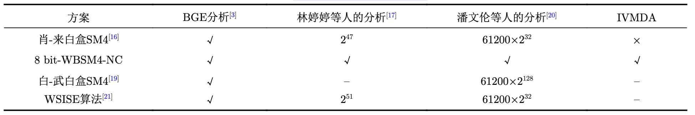

# SM4白盒密码算法使用说明

## 方案说明
SM4算法加密速度快、安全级别高，在数据安全领域应用广泛。使用SM4时需要保护好密钥，才能实现应用的数据安全，在资源受限没有硬件加密模块的终端设备中，尤其需要有技术手段保护密钥的安全性。白盒密码算法能够对密钥进行有效保护，即使攻击者对加密代码和应用运行环境完全控制情况下，也能防止原始密钥泄露。

SM4白盒密码算法的算法设计、密码分析国内有丰富的研究成果，铜锁参考这些研究成果确定了实现方案。2009年，肖雅莹等设计了首个SM4白盒方案(肖-来方案)<sup>[1]</sup>, 2013年，林婷婷、来学嘉对该算法进行攻击分析<sup>[4]</sup>, 证明了攻击过程的时间复杂度上界为2<sup>47</sup>；2016 年, 白鲲鹏等构造了另外一个白盒实
现 SM4 的方案(白-武方案)<sup>[2]</sup>, 该方案与肖-来方案类似, 增大了分析的难度, 使用了更多的随机数来提高算法的混淆程度；2020年，姚思等人结合混淆密钥与查找表技术提出了一种内部状态扩充的白盒SM4实现方案 (White-box implementation of SM4 algorithm with Internal State Expansion, WSISE方案)<sup>[3]</sup>，该方案显著提高了攻击者提取密钥的复杂度。2018年，潘文伦等进行了白盒方案分析<sup>[4]</sup>，计算了肖-来方案、白-武方案的密钥搜索空间；2022年张跃宇进行了白盒SM4的分析与改进<sup>[5]</sup>， 总结了白盒实现方案的安全性对比，参见下表<sup>[5]</sup>。



铜锁在SM4白盒算法实现选择了肖-来、白-武、WSISE三个方案，代码实现移植自Nexus-TYF的开源实现<sup>[6]</sup>，对代码进行重构完成在Tongsuo内集成。原代码包含了底层的矩阵运算库，实现了三个白盒算法的block块加密接口，铜锁通过KDF接口进行加密白盒密钥产生，并通过EVP接口支持白盒密钥的加密应用，支持ECB、CBC、CFB、OFB、CTR、CTR、GCM模式。ECB、CBC、CFB、OFB模式解密数据时，仍需使用原始的SM4密钥。<br>

## 编译参数
铜锁支持三种白盒算法模式，可根据需要通过编译参数开启：<br>
```shell
./config enable-wbsm4-xiaolai enable-wbsm4-baiwu enable-wbsm4-wsise
```

## 命令行使用
命令行可以进行白盒密钥产生，支持ECB、CBC模式加密，支持CTR模式加密及解密: <br>
```shell
# 产生白盒密钥
./apps/openssl kdf -kdfopt key:0123456789abcdeffedcba9876543210 -cipher wbsm4-xiaolai -out wbsm4.key -binary wbsm4kdf

# ECB模式加密
./apps/openssl enc -e -wbsm4-xiaolai-ecb -in data.bin -out data.enc -kbinary wbsm4.key
./apps/openssl enc -d -sm4-ecb -in data.enc -out data.dec -K 0123456789abcdeffedcba9876543210

# CTR模式解密
./apps/openssl enc -e -sm4-ctr -in data.bin -out data.enc -K 0123456789abcdeffedcba9876543210 -iv 0123456789abcdeffedcba9876543210
./apps/openssl enc -d -wbsm4-xiaolai-ctr -in data.enc -out data.dec -kbinary wbsm4.key -iv 0123456789abcdeffedcba9876543210
```

## EVP接口使用
通过EVP接口可以完成KDF白盒密钥产生，调用ECB、CBC、CTR、CFB、OFB、CTR、CTR、GCM等加密模式:
```c
/* KDF产生白盒密钥 */
OSSL_PARAM params[3];
params[0] = OSSL_PARAM_construct_utf8_string("key", "0123456789abcdeffedcba9876543210", 0);
params[1] = OSSL_PARAM_construct_utf8_string("cipher", "wbsm4-xiaolai", 0);
params[2] = OSSL_PARAM_construct_end();

EVP_KDF *kdf = EVP_KDF_fetch(NULL, "wbsm4kdf", NULL);
EVP_KDF_CTX *ctx = EVP_KDF_CTX_new(kdf);
rv = EVP_KDF_CTX_set_params(ctx, params);

size_t wbsm4key_len = EVP_KDF_CTX_get_kdf_size(ctx);
unsigned char *wbsm4key =  (unsigned char *)OPENSSL_malloc(wbsm4key_len);
rv = EVP_KDF_derive(ctx, wbsm4key, wbsm4key_len, NULL);

/* CBC模式加密 */
EVP_CIPHER *cipher = EVP_CIPHER_fetch(NULL, "wbsm4-xiaolai-cbc", NULL);
EVP_CIPHER_CTX *cipher_ctx = EVP_CIPHER_CTX_new();
rv = EVP_CipherInit_ex(cipher_ctx, cipher, NULL, wbsm4key, iv, 1);

rv = EVP_EncryptUpdate(cipher_ctx, out, &outlen, in, inlen);
```

## 性能参数
SM4白盒密码算法密钥占用较大的存储空间，在应用过程中需要预留充足的内存、磁盘空间，参见三个算法的密钥长度：<br>

| 白盒密码算法   | 密钥长度(字节) |
|--------------|----------|
| wbsm-xiaolai | 153,248 = 150K   |
| wbsm-baiwu   | 34,079,776 = 32.51M    |
| wbsm-wsise   | 284,320 = 278K |

相较于原生SM4算法，SM4白盒密码算法加密性能有下降明显，适合于数据量稍小的应用场景，参见如下性能对比：
```shell
./apps/openssl speed sm4 wbsm4-xiaolai wbsm4-baiwu wbsm4-wsise

compiler: cc -fPIC -arch arm64 -O3 -Wall -DL_ENDIAN -DOPENSSL_PIC -D_REENTRANT -DOPENSSL_BUILDING_OPENSSL -DNDEBUG 
CPUINFO: OPENSSL_armcap=0x7f

The 'numbers' are in 1000s of bytes per second processed.
type                16 bytes     64 bytes    256 bytes   1024 bytes   8192 bytes  16384 bytes
sm4-cbc           161737.30k   163101.08k   165667.02k   165818.14k   165284.52k   165128.87k
wbsm4-xiaolai-cbc   4489.72k      749.12k      750.45k      749.91k      747.97k      748.20k
wbsm4-baiwu-cbc    40326.22k     5084.16k     5115.89k     5154.13k     5134.38k     5133.65k
wbsm4-wsise-cbc     4366.73k      739.04k      740.51k      743.17k      745.47k      737.28k
```
## 参考文献
[1] 肖雅莹,来学嘉 白盒密码及SMS4算法的白盒实现<br>
[2] BAI Kunpeng,WU Chuankun A secure white-box SM4
implementation<br>
[3] 姚思,陈杰 SM4算法的一种新型白盒实现<br>
[4] 林婷婷,来学嘉 对白盒SMS4实现的一种有效攻击<br>
[4] 潘文伦,秦体红,贾音,张立廷 对两个SM4白盒方案的分析<br>
[5] 张跃宇,徐东,陈杰 白盒SM4的分析与改进<br>
[6] https://github.com/Nexus-TYF
