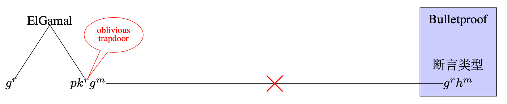
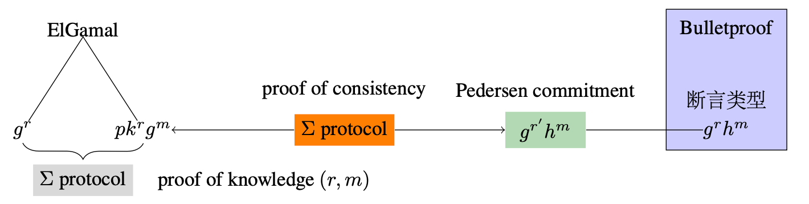
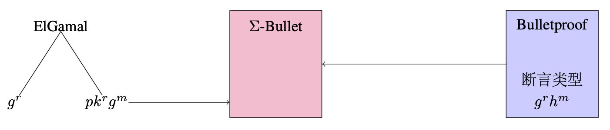
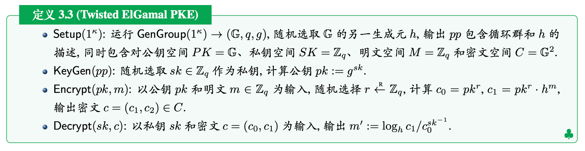
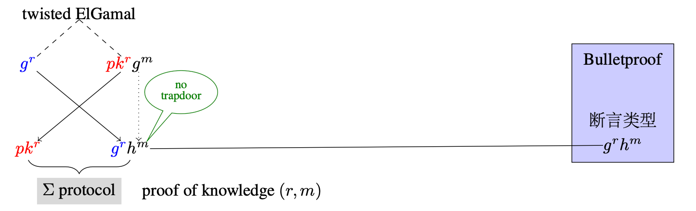
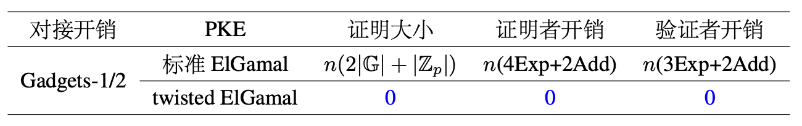

# 铜锁支持零知识证明友好的半同态加密算法Twisted EC-ElGamal
## 背景
近半个世纪, 随着网络技术的飞速发展，计算模式逐渐由集中式迁移分布式，新型计算模式对加密方案的需求也从单一的机密性保护扩展到对隐私计算的支持，半同态加密算法 ElGamal 支持整数上的模加运算 “+” 同态, 适用于密态计算场景，在区块链和机器学习等涉及恶意敌手的计算场景中，还常需要**以隐私保护的方式证明密文加密的明文满足声称的约束关系**，例如，可以在加密状态下验证用户是否拥有足够的资金，而无需透露具体的账户余额，这就需要结合零知识区间范围证明来实现。
零知识密态区间范围证明可以根据证明者的角色分为两类场景:

1. 证明者为密文生成方：证明者知晓加密随机数和明文；
2. 证明者为密文接收方：证明者知晓解密私钥和明文；

我们称上面两种情形下完成密态证明的组件为 Gadget-1 和 Gadget-2。下面详细讨论 Gadget-1 的构造，Gadget-2 的设计可以通过重加密技术归结为 Gadget-2。
## 原理
目前比较高效的半同态加密算法和范围证明协议分别为EC Exponential ElGamal PKE(椭圆曲线群上的指数形式ElGamal公钥加密, 以下简称为ElGamal PKE) 和 Bulletproof，其中Bulletproof 接收的断言形式为Pedersen承诺。

**ElGamal PKE与Bulletproof的组合应用.** 密文的生成方如何为密文加密的明文生成范围证明呢? 注意到尽管ElGamal密文的第二项也是 Pedersen 承诺的形式, 但当证明者为密文生成方时, 其知晓承诺密钥$(pk, g)$之间的离散对数$sk$, 因此无法调用 Bulletproof 完成证明 (合理性得不到保证)，如图1所示：

（图1：ElGamal PKE无法与 Bulletproof 直接对接）
解决该问题有两种技术手段：

1. 证明者首先使用 NIZKPoK 证明其知晓密文的随机数和消息, 再引入新的 Pedersen 承诺作为桥接, 并设计 Σ 协议证明新承诺的消息与明文的一致性 (注: 该 Sigma 协议可与第一步的 NIZKPoK 协议合并设计), 再调用 Bulletproof 对桥接承诺进行证明, 如图2所示. 该方法的缺点是需要引入**桥接承诺和额外的 Σ 协议**, 增大了证明和验证的开销。

（图2：ElGamal PKE的密态范围证明组件Gadget-1之设计方法一）

2. 结合待证明的 ElGamal PKE 密文结构对 Bulletproof 进行重新设计, 使用量身定制的 Σ-Bulletproof 完成证明, 如图3所示. 该方法的缺点是需要对 Bulletproof 进行定制化拆解重构, 不具备模块化特性。

（图3：ElGamal PKE的密态范围证明组件Gadget-1之设计方法二）
上述两种技术手段均存在不足. 为了解决这一问题, 山东大学网络空间安全学院陈宇教授对标准的ElGamal PKE进行变形扭转, 将封装密文与会话密钥的位置对调, 同时更改明文同构映射编码的基底, 得到 twisted ElGamal PKE，以下是陈宇教授对 Twisted ElGamal PKE 的定义：

### 零知识证明友好特性
Twisted ElGamal PKE与标准ElGamal PKE 的性能和安全性相当, 同样满足整数上的模加同态. 特别的, 密文的第二部分恰好是标准的 Pedersen承诺形态，且承诺密钥陷门未知, 因此可**无缝对接 **Bulletproof 等一系列断言类型为 Pedersen承诺的区间范围证明, 无须进行桥接即可以黑盒的方式调用现有的区间范围证明协议, 如图4所示. 我们称公钥加密方案的这种性质为零知识证明友好。

               （图4：Twisted ElGamal PKE的密态范围证明组件Gadget-1）

Twisted ElGamal PKE的密态证明组件Gadget-2的设计可以通过如下步骤完成: 
1、证明者使用私钥对密文进行部分解密; 
2、证明者选取新的随机数对部分解密结果进行重加密得到新密文; 
3、证明者设计NIZK协议证明新旧密文的一致性, 即均是对同一个消息的加密(具体可通过证明DDH元组的Sigma协议实现); 
4、证明者调用Gadget-1对新密文完成密态证明. 

**比较.** 相比标准的ElGamal PKE, twisted ElGamal PKE的显著优势在于**零知识证明友好**。下表对比了两者的密态证明组件的效率：
（表1：标准ElGamal PKE和twisted ElGamal PKE与Bulletproof 对接开销的对比）

上表以twisted ElGamal PKE的对接开销为比较基准。在统计证明者和验证者开销时, 省去了数域上的操作, 因其代价相比椭圆曲线群上的操作相比可忽略，n是需要证明的密文数，在很多实际应用中, 单个证明者需要对多个密文通过 Gadgets-1/2 进行区间范围证明，当密文数量为百万量级时, 使用 twisted ElGamal PKE带来的性能提升是相当可观的。

以上内容参考了陈宇教授的《公钥加密设计方法》一书手稿。更详细的原理和C++实现请查阅陈宇教授的论文：[https://eprint.iacr.org/2019/319](https://eprint.iacr.org/2019/319)

铜锁开源密码学算法库对Bulletproofs和twisted ElGamal PKE进行了完善的支持，从而显著增强了铜锁库的隐私计算能力、赋能更多的隐私计算应用。铜锁公众号中的使用教程文档如下：

铜锁支持 Bulletproofs 算法：[https://mp.weixin.qq.com/s/eI0Dky-cG5biKjT-EelnHQ](https://mp.weixin.qq.com/s/eI0Dky-cG5biKjT-EelnHQ)

铜锁 Bulletproofs Range 使用教程：[https://mp.weixin.qq.com/s/oA2L5TduOti1R2WnqOwapQ](https://mp.weixin.qq.com/s/oA2L5TduOti1R2WnqOwapQ) 

铜锁 Bulletproofs R1CS 使用教程：[https://mp.weixin.qq.com/s/vKRl4fLyEuNF78JcqYYVfw](https://mp.weixin.qq.com/s/vKRl4fLyEuNF78JcqYYVfw) 

此外，如果对代码实现有兴趣也请直接查阅铜锁 zkp 算法的实现：[https://github.com/Tongsuo-Project/Tongsuo/tree/master/crypto/zkp](https://github.com/Tongsuo-Project/Tongsuo/tree/master/crypto/zkp)

